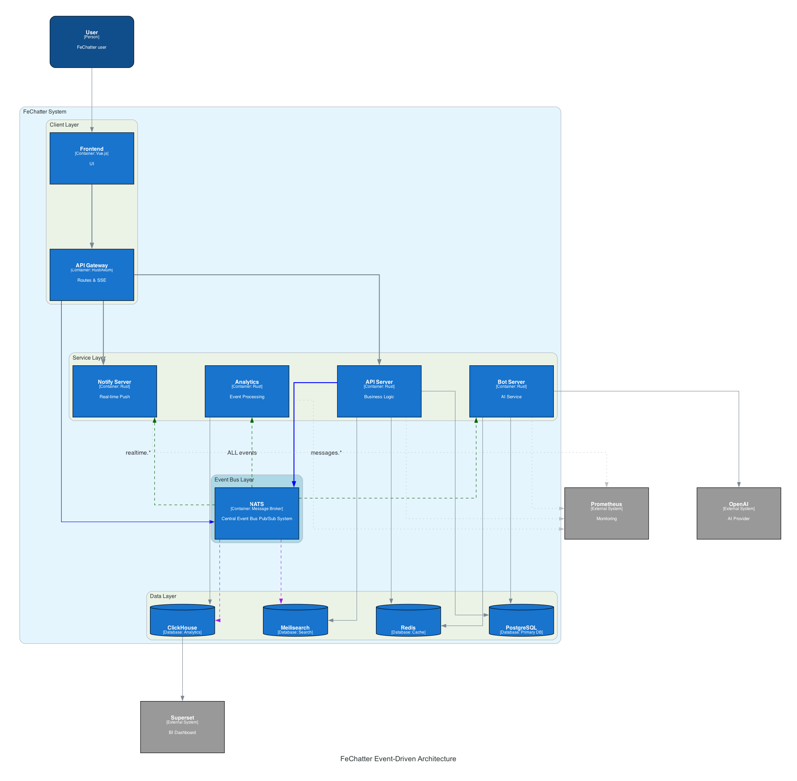

# FeChatter Architecture

## System Overview

FeChatter is an event-driven microservices chat platform built with Rust.

### System Architecture Diagram

```
┌─────────────────────────────────────────────────────────────────────────┐
│                            Client Layer                                 │
│     ┌─────────────────────┐        ┌──────────────────────┐             │
│     │  fechatter_frontend │        │  Client Applications │             │
│     │  Vue 3 + TypeScript │        │   (Web/Mobile/API)   │             │
│     │       :5173         │        └──────────────────────┘             │
│     └─────────────────────┘                                             │
└─────────────────────────────────────────────────────────────────────────┘
                                  │
                                  ▼
┌─────────────────────────────────────────────────────────────────────────┐
│                            Gateway Layer                                │
│                    ┌──────────────────────────┐                         │
│                    │   fechatter_gateway      │                         │
│                    │    Pingora Proxy         │                         │
│                    │        :8080             │                         │
│                    └──────────────────────────┘                         │
└─────────────────────────────────────────────────────────────────────────┘
                                    │
       ┌────────────────────────────┼──────────────────────────────┐
       │                            │                              │
       ▼                            ▼                              ▼
┌─────────────────────────────────────────────────────────────────────────┐
│                              Core Services                              │
│      ┌─────────────────┐  ┌─────────────────┐  ┌─────────────────┐      │
│      │ fechatter_server│  │  notify_server  │  │   bot_server    │      │
│      │  Axum + SQLx    │  │  Tokio + SSE    │  │  OpenAI SDK     │      │
│      │     :6688       │  │     :6687       │  │     :6686       │      │
│      └─────────────────┘  └─────────────────┘  └─────────────────┘      │
│                           ┌─────────────────┐                           │
│                           │ analytics_server│                           │
│                           │   ClickHouse    │                           │
│                           │     :6690       │                           │
│                           └─────────────────┘                           │
└─────────────────────────────────────────────────────────────────────────┘
           │                      │                    │
           ▼                      ▼                    ▼
┌─────────────────────────────────────────────────────────────────────────┐
│                              Data Layer                                 │
│  ┌──────────────┐  ┌──────────────┐  ┌──────────────┐  ┌────────────┐   │
│  │  PostgreSQL  │  │    Redis     │  │ S3 Compatible│  │ClickHouse  │   │
│  │Primary DB    │  │Cache/Sessions│  │File Storage  │  │ Analytics  │   │
│  └──────────────┘  └──────────────┘  └──────────────┘  └────────────┘   │
│  ┌──────────────┐  ┌──────────────┐                                     │
│  │ Meilisearch  │  │NATS JetStream│                                     │
│  │ Full-text    │  │Message Queue │                                     │
│  │   Search     │  │              │                                     │
│  └──────────────┘  └──────────────┘                                     │
└─────────────────────────────────────────────────────────────────────────┘
                                  │
                                  ▼
┌─────────────────────────────────────────────────────────────────────────┐
│                           External Services                             │
│       ┌──────────────────────┐        ┌──────────────────────┐          │
│       │   Apache Superset    │        │     OpenAI API       │          │
│       │       :8088          │        │   (External Service) │          │
│       └──────────────────────┘        └──────────────────────┘          │
└─────────────────────────────────────────────────────────────────────────┘
                                  │
                                  ▼
┌─────────────────────────────────────────────────────────────────────────┐
│                       Shared Infrastructure                             │
│     ┌────────────────┐  ┌────────────────┐  ┌────────────────┐          │
│     │ fechatter_core │  │fechatter_protos│  │    ai_sdk      │          │
│     │ Common Types   │  │Protocol Buffers│  │AI Integrations │          │
│     └────────────────┘  └────────────────┘  └────────────────┘          │
└─────────────────────────────────────────────────────────────────────────┘
```

### Event-Driven Architecture



## Core Components

### Services
- **Gateway** (8080): Routes requests, handles SSE
- **API Server** (6688): Business logic, authentication
- **Bot Server** (6686): AI chat integration
- **Analytics Server** (6690): Event processing
- **Notify Server** (6687): Real-time notifications

### Data Stores
- **PostgreSQL**: Primary database
- **Redis**: Cache and sessions
- **ClickHouse**: Analytics data
- **Meilisearch**: Full-text search
- **NATS**: Event bus

### External
- **OpenAI**: AI provider
- **Prometheus**: Monitoring
- **Superset**: BI dashboard

## Event Flow

```
User → Frontend → Gateway → API Server → PostgreSQL
                                      → NATS → Bot/Analytics/Notify
```

## Key Patterns

### Event-Driven
- All services publish/subscribe via NATS
- Async updates to Meilisearch and ClickHouse
- Real-time notifications through SSE

### Data Flow
1. **Write**: API Server → PostgreSQL + NATS
2. **Search**: API Server → Meilisearch
3. **Cache**: Redis for hot data
4. **Analytics**: NATS → ClickHouse

## Technology Stack

- **Language**: Rust (performance + safety)
- **Web Framework**: Axum
- **Database**: PostgreSQL + Redis
- **Message Queue**: NATS
- **Frontend**: Vue.js

## Deployment

### Development
```yaml
Docker Compose: All services single instance
```

### Production
```yaml
Kubernetes: Multi-replica with auto-scaling
- Gateway: 3-10 replicas
- API Server: 5-20 replicas
- Databases: Clustered
```

## Security

- JWT authentication at Gateway
- TLS for all communication
- Input validation at entry points

---

*For detailed API documentation, see [fechatter_server/docs/](./fechatter_server/docs/)*
