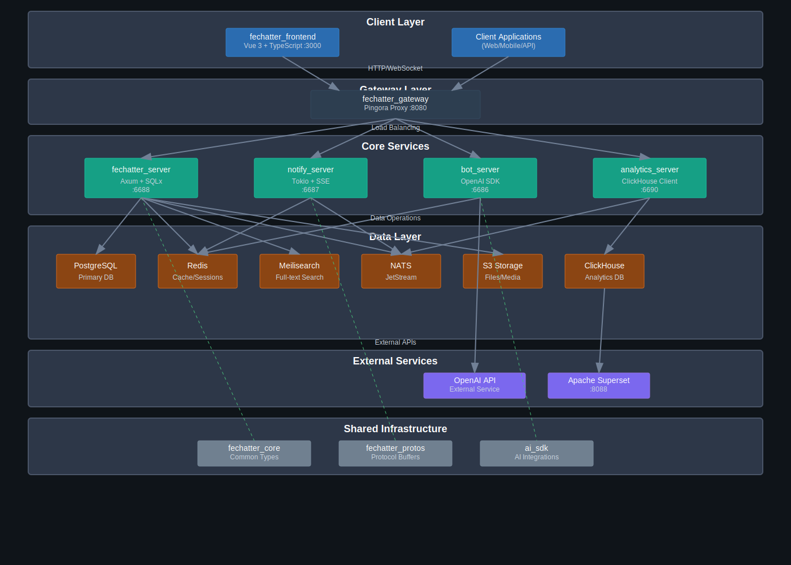

<div align="center">
  

<h1>Fechatter</h1>

<p>
    <strong>Efficient, enterprise-ready real-time chat platform powered by Rust</strong>
  </p>

<p>
    <a href="README.md">🇺🇸 English</a> •
    <a href="README.zh-CN.md">🇨🇳 中文</a> •
    <a href="README.ja.md">🇯🇵 日本語</a>
  </p>

  <p>
    <a href="https://github.com/Kevinzh0C/Fechatter/blob/master/LICENSE">
      
    </a>
    <a href="https://www.rust-lang.org/">
      
    </a>
    <a href="https://github.com/Kevinzh0C/Fechatter/actions">
      
    </a>
  </p>

<p>
    <a href="https://fechatter-frontend.vercel.app">🚀 Live Demo</a> •
    <a href="#-getting-started">Getting Started</a> •
    <a href="#-features">Features</a> •
    <a href="#-architecture">Architecture</a> •
    <a href="#-contributing">Contributing</a>
  </p>
</div>

---

## ✨ What is Fechatter?

Fechatter is a **modern, comprehensive chat platform** that combines the **efficiency of Rust** with **enterprise-grade features** to deliver an exceptional messaging experience. Whether you're building a team collaboration tool or a community platform, Fechatter provides a robust foundation with all the features you need out of the box.

### 🎮 Try it now

<div align="center">
  <a href="https://fechatter-frontend.vercel.app" target="_blank">
    
  </a>
</div>

## 🎯 Features

- 💬 **Real-time Messaging** - Send and receive messages instantly using Server-Sent Events (SSE)
- 🤖 **AI Chat Bot** - Integrated ChatGPT-powered assistant for conversations
- 🔍 **Message Search** - Full-text search capabilities powered by Meilisearch
- 🏢 **Workspace Support** - Organize chats and users in separate workspaces
- 📁 **File Sharing** - Upload and share files within conversations
- 🔐 **JWT Authentication** - Secure token-based authentication system
- 📊 **Analytics Integration** - Track usage metrics with ClickHouse and Apache Superset
- 🏗️ **Microservices Architecture** - Modular design with separate services for different functions

## 🚀 Getting Started

### Quick Start

Get Fechatter running in under 2 minutes:

```bash
# Clone the repository
git clone https://github.com/Kevinzh0C/fechatter.git
cd fechatter

# Copy environment config
cp .env.example .env

# Start all services
docker-compose up -d

# Open in your browser
open http://localhost:8080
```

That's it! 🎉

### Requirements

- Docker 20.10 or higher
- Docker Compose 2.0 or higher
- 4GB RAM minimum
- Port 8080 available

Need help? Check our [Quick Start Guide](./docs/QUICK_START.md).

## 🏗️ Architecture

Fechatter uses a **microservices architecture** designed for scalability and reliability:

<div align="center">
  
</div>

### System Architecture Overview

```
Client Applications
    ↓
API Gateway (Pingora :8080)
    ↓
Core Services:
├── Fechatter Server (:6688) → PostgreSQL, Redis, Meilisearch, NATS, S3
├── Notify Server (:6687) → Redis, NATS
├── Bot Server (:6686) → Redis, OpenAI API
└── Analytics Server (:6690) → ClickHouse, NATS

External Services:
└── Apache Superset (:8088) → ClickHouse
```

### Service Dependencies Matrix

| Service             | PostgreSQL | Redis | ClickHouse | NATS | Meilisearch | OpenAI | S3 |
| ------------------- | :--------: | :---: | :--------: | :--: | :---------: | :----: | :-: |
| **Chat**      |     ✓     |  ✓  |     -     |  ✓  |     ✓     |   -   | ✓ |
| **Notify**    |     -     |  ✓  |     -     |  ✓  |      -      |   -   | - |
| **Bot**       |     -     |  ✓  |     -     |  -  |      -      |   ✓   | - |
| **Analytics** |     -     |   -   |     ✓     |  ✓  |      -      |   -   | - |

### 📋 Service Overview

| Service                    | Port | Technology  | Purpose                       |
| -------------------------- | ---- | ----------- | ----------------------------- |
| **API Gateway**      | 8080 | Pingora     | Load balancing, routing, auth |
| **Fechatter Server** | 6688 | Axum, SQLx  | Core chat functionality       |
| **Notify Server**    | 6687 | Tokio, SSE  | Real-time notifications       |
| **Bot Server**       | 6686 | OpenAI SDK  | AI chat assistance            |
| **Analytics Server** | 6690 | ClickHouse  | Event tracking & metrics      |
| **Frontend**         | 3000 | Vue 3, Vite | User interface                |

Learn more in our [Architecture Guide](./ARCHITECTURE.md).

## 💻 Development

### Local Development

```bash
# Install dependencies
make setup

# Start development environment
make dev

# Run tests
make test

# Build for production
make build
```

### Tech Stack

- **Backend**: Rust, Axum, Tokio, SQLx
- **Frontend**: Vue 3, TypeScript, Vite
- **Gateway**: Pingora (Cloudflare's proxy framework)
- **Database**: PostgreSQL, Redis
- **Search**: Meilisearch
- **Message Queue**: NATS JetStream
- **Analytics**: ClickHouse, Apache Superset
- **Deployment**: Docker, Kubernetes

## 📚 Documentation

### Getting Started

- [Quick Start Guide](./docs/QUICK_START.md) - Get running in 2 minutes
- [Installation Guide](./docs/INSTALLATION.md) - Detailed setup
- [Configuration](./fechatter_server/docs/CONFIGURATION.md) - Environment setup

### Core Documentation

- [Architecture Overview](./ARCHITECTURE.md) - System design
- [API Reference](./fechatter_server/docs/API_REFERENCE.md) - REST API
- [Development Guide](./fechatter_server/docs/DEVELOPMENT_GUIDE.md) - Dev setup

### Deployment & Operations

- [Deployment Guide](./fechatter_server/docs/DEPLOYMENT_GUIDE.md) - Production deployment
- [Performance Guide](./fechatter_server/docs/PERFORMANCE_GUIDE.md) - Optimization tips

## 🤝 Contributing

We love your input! We want to make contributing to Fechatter as easy and transparent as possible.

Check out our [Contributing Guide](./CONTRIBUTING.md) to get started.

### Good First Issues

Looking for a place to start? Check out our [good first issues](https://github.com/Kevinzh0C/Fechatter/labels/good%20first%20issue).

## 📄 License

Fechatter is [MIT licensed](./LICENSE).

---

<div align="center">
  <p>
    <sub>Built with ❤️ by developers, for developers</sub>
  </p>
  <p>
    <a href="https://github.com/Kevinzh0C/Fechatter">⭐ Star us on GitHub</a>
  </p>
</div>
