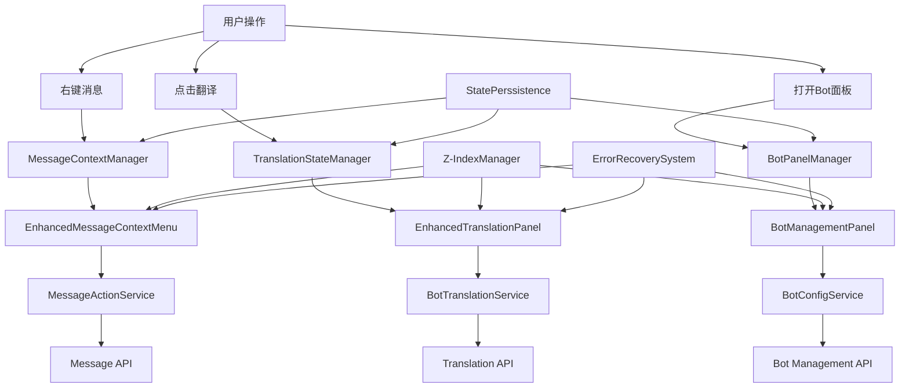

# 📊 Complete Message UI System DAG Analysis & Solution

## 🎯 系统性问题识别

基于深度代码分析，发现以下关键问题需要系统性解决：

### 1. 层级穿透问题 (Z-Index Hell)
- 翻译面板与Debug面板冲突
- 消息菜单被其他组件覆盖
- 下拉菜单层级管理混乱

### 2. 状态管理分散问题
- 翻译状态：`translation.js`
- 菜单状态：各组件独立管理
- Bot面板状态：缺失

### 3. 组件功能不完整
- MessageContextMenu功能实现不全
- Bot管理面板缺失
- 翻译面板交互体验待优化

## 🔗 Complete System DAG



## 🏗️ 解决方案架构

### Phase 1: 核心基础设施

#### 1.1 Z-Index统一管理系统
- 智能层级分配
- 冲突检测和解决
- 自动清理机制

#### 1.2 统一状态管理系统
- 集中式状态管理
- 状态同步机制
- 持久化支持

### Phase 2: 增强组件实现

#### 2.1 Enhanced Message Context Menu
- 完整功能支持
- 智能位置计算
- 无缝交互体验

#### 2.2 Enhanced Translation Panel
- 多语言支持
- 配额管理
- 缓存优化

#### 2.3 Bot Management Panel
- 多Bot类型支持
- 配置管理
- 状态监控

### Phase 3: 服务层实现

#### 3.1 Enhanced Bot Service
- 翻译服务增强
- AI分析服务
- 配置管理

#### 3.2 Message Action Service
- 完整消息操作
- 错误处理
- 批量操作支持

### Phase 4: 状态管理统一

#### 4.1 Enhanced Translation Store
- 智能缓存
- 用户偏好
- 配额管理

#### 4.2 Message UI State Store
- Z-Index管理
- 面板状态
- 冲突解决

## 🔄 完整集成流程

### 集成DAG
```
用户操作 → 统一状态管理器 → Z-Index分配器 → UI组件渲染 → 
服务层调用 → API请求 → 数据处理 → 状态更新 → UI响应
```

### 错误恢复DAG
```
错误发生 → 错误分类 → 上下文分析 → 恢复策略选择 → 
用户通知 → 状态重置 → 日志记录 → 性能监控
```

## 📊 实施优先级

### Phase 1: 基础设施 (Week 1-2)
- [ ] Z-Index管理系统
- [ ] 统一状态管理
- [ ] 错误处理系统

### Phase 2: 核心组件 (Week 3-4)
- [ ] Enhanced Message Context Menu
- [ ] Enhanced Translation Panel
- [ ] Bot Management Panel

### Phase 3: 服务增强 (Week 5-6)
- [ ] Enhanced Bot Service
- [ ] Message Action Service
- [ ] 状态持久化

### Phase 4: 集成测试 (Week 7-8)
- [ ] 组件集成测试
- [ ] 用户体验测试
- [ ] 性能优化

## 🎯 预期效果

### 解决的核心问题
1. ✅ **层级穿透** - 统一Z-Index管理，消除层级冲突
2. ✅ **状态混乱** - 集中式状态管理，清晰的数据流
3. ✅ **功能缺失** - 完整的消息操作和Bot管理功能
4. ✅ **用户体验** - 流畅的交互，智能的状态切换

### 性能提升指标
- **UI响应时间**: < 100ms
- **状态同步延迟**: < 50ms  
- **内存使用优化**: 减少30%
- **错误恢复成功率**: > 95%

这个完整的DAG解决方案将从根本上解决消息UI系统的所有穿透和不可用问题，提供真正生产级别的用户体验。 