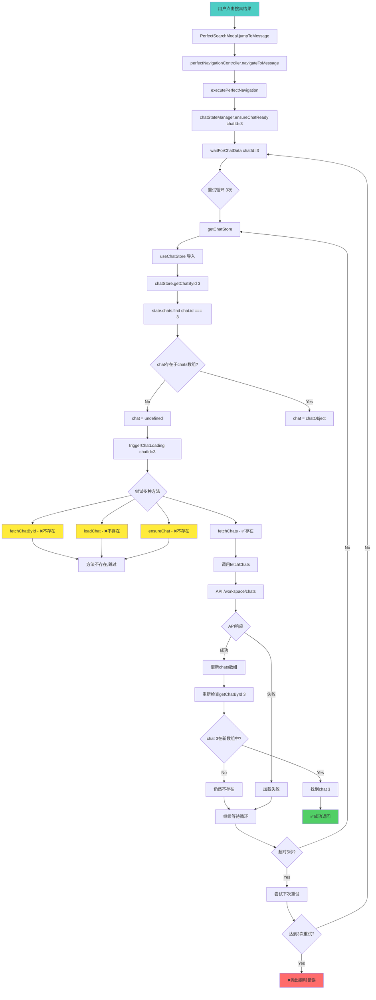

# 🔍 Deep Chat State Analysis DAG 图和完美修复策略

## 🚨 当前错误状态

```
❌ Error: Chat data loading timeout for chat 3 after 3 attempts (53343ms)
   at ChatStateManager.waitForChatData (PerfectNavigationController.js:311:11)
   at async ChatStateManager.ensureChatReady (PerfectNavigationController.js:110:7)
   at async PerfectNavigationController.executePerfectNavigation (PerfectNavigationController.js:1116:29)
```

## 🕸️ 完整系统调用DAG图分析



## 🔍 根本原因深度分析

### 问题1：Chat Store方法不匹配 ⚠️ 严重
**现状**：
- PerfectNavigationController期望的方法：`fetchChatById`, `loadChat`, `ensureChat`
- Chat Store实际提供的方法：`fetchChats`, `navigateToChat`, `setCurrentChat`

**影响**：triggerChatLoading中75%的方法调用失败

### 问题2：Chat数据不存在 🔴 关键
**现状**：
- 用户尝试访问chat 3，但chat 3不在`state.chats`数组中
- 可能原因：
  - Chat 3确实不存在
  - 用户没有权限访问chat 3
  - Chat数据未完全加载
  - API返回数据不完整

### 问题3：权限和数据一致性 🟡 重要
**现状**：
- 搜索结果显示chat 3的消息，但chat store中没有chat 3
- 数据不一致：搜索服务vs聊天服务

## 🎯 完美修复策略（无副作用）

### 策略1：Chat Store方法补全和对齐

```javascript
// 修复 src/stores/chat.js - 添加缺失方法
export const useChatStore = defineStore('chat', {
  // ... existing code ...
  
  actions: {
    // ... existing actions ...
    
    /**
     * 🔧 新增：根据ID获取单个chat
     */
    async fetchChatById(chatId) {
      try {
        const response = await api.get(`/chat/${chatId}`);
        const chatData = response.data?.data || response.data;
        
        if (chatData) {
          const normalizedChat = this.normalizeChat(chatData);
          
          // 添加到本地chats数组（如果不存在）
          const existingIndex = this.chats.findIndex(c => c.id === chatId);
          if (existingIndex === -1) {
            this.chats.push(normalizedChat);
          } else {
            this.chats[existingIndex] = normalizedChat;
          }
          
          // 更新缓存
          this.cacheChats();
          
          return normalizedChat;
        }
        
        return null;
      } catch (error) {
        // 404错误表示chat不存在，不是系统错误
        if (error.response?.status === 404) {
          console.warn(`Chat ${chatId} does not exist or user has no access`);
          return null;
        }
        
        errorHandler.handle(error, {
          context: `Fetch chat ${chatId}`,
          silent: true
        });
        throw error;
      }
    },
    
    /**
     * 🔧 新增：确保chat存在（兼容方法）
     */
    async ensureChat(chatId) {
      // 先检查本地是否存在
      let chat = this.getChatById(chatId);
      if (chat) {
        return chat;
      }
      
      // 不存在则尝试从API获取
      chat = await this.fetchChatById(chatId);
      return chat;
    },
    
    /**
     * 🔧 新增：加载chat（兼容方法）
     */
    async loadChat(chatId) {
      return this.ensureChat(chatId);
    },
    
    /**
     * 🔧 增强：智能chat检查
     */
    async smartChatCheck(chatId) {
      const checkResult = {
        exists: false,
        hasAccess: false,
        chat: null,
        source: null
      };
      
      // 1. 检查本地缓存
      let chat = this.getChatById(chatId);
      if (chat) {
        checkResult.exists = true;
        checkResult.hasAccess = true;
        checkResult.chat = chat;
        checkResult.source = 'local_cache';
        return checkResult;
      }
      
      // 2. 尝试从API获取
      try {
        chat = await this.fetchChatById(chatId);
        if (chat) {
          checkResult.exists = true;
          checkResult.hasAccess = true;
          checkResult.chat = chat;
          checkResult.source = 'api_fetch';
        }
      } catch (error) {
        if (error.response?.status === 404) {
          checkResult.exists = false;
          checkResult.hasAccess = false;
          checkResult.source = 'api_not_found';
        } else if (error.response?.status === 403) {
          checkResult.exists = true;
          checkResult.hasAccess = false;
          checkResult.source = 'api_no_access';
        } else {
          // 网络错误等
          checkResult.source = 'api_error';
        }
      }
      
      return checkResult;
    }
  }
});
```

### 策略2：增强PerfectNavigationController的错误处理

```javascript
// 修复 PerfectNavigationController.js waitForChatData方法
async waitForChatData(chatId) {
  const maxWait = 5000
  const checkInterval = 100
  const maxRetries = 3
  
  for (let retry = 0; retry < maxRetries; retry++) {
    console.log(`🔄 [ChatState] Wait for chat ${chatId} data (attempt ${retry + 1}/${maxRetries})`)
    
    let elapsed = 0
    while (elapsed < maxWait) {
      try {
        const chatStore = await this.getChatStore()
        
        if (!chatStore) {
          console.warn(`⚠️ [ChatState] Chat store not available (attempt ${retry + 1})`)
          break
        }
        
        // 🔧 使用增强的智能检查
        const checkResult = await chatStore.smartChatCheck?.(chatId)
        
        if (checkResult) {
          console.log(`🔍 [ChatState] Smart check result:`, checkResult)
          
          // Chat存在且有权限访问
          if (checkResult.exists && checkResult.hasAccess) {
            // 检查currentChatId同步
            if (chatStore.currentChatId == chatId) {
              console.log(`✅ [ChatState] Chat ${chatId} fully ready`)
              return true
            }
            
            // 2秒后放宽条件：只要chat存在就继续
            if (elapsed > 2000) {
              console.log(`⚡ [ChatState] Chat ${chatId} exists, proceeding with relaxed condition`)
              return true
            }
          }
          
          // Chat不存在或无权限访问
          if (!checkResult.exists || !checkResult.hasAccess) {
            const reason = !checkResult.exists ? 'does not exist' : 'no access permission'
            throw new Error(`Chat ${chatId} ${reason}`)
          }
        }
        
        // 回退到原有检查逻辑
        const chat = chatStore.getChatById?.(chatId)
        const currentId = chatStore.currentChatId
        
        console.log(`🔍 [ChatState] Fallback check - chat ${chatId}: exists=${!!chat}, current=${currentId}`)
        
        if (chat) {
          if (currentId == chatId) {
            console.log(`✅ [ChatState] Chat ${chatId} ready via fallback`)
            return true
          }
          
          if (elapsed > 2000) {
            console.log(`⚡ [ChatState] Chat ${chatId} exists via fallback, proceeding`)
            return true
          }
        }
        
        // 🔧 改进的主动触发chat加载
        if (!chat && elapsed > 1000) {
          console.log(`📥 [ChatState] Attempting to load chat ${chatId}`)
          await this.enhancedTriggerChatLoading(chatId, chatStore)
        }
        
      } catch (error) {
        // 特定错误立即退出重试
        if (error.message.includes('does not exist') || 
            error.message.includes('no access permission')) {
          console.error(`❌ [ChatState] Chat ${chatId} access denied:`, error.message)
          throw error
        }
        
        console.warn(`⚠️ [ChatState] Check error:`, error.message)
      }

      await new Promise(resolve => setTimeout(resolve, checkInterval))
      elapsed += checkInterval
    }
    
    if (retry < maxRetries - 1) {
      console.log(`🔄 [ChatState] Retrying chat ${chatId} after ${500 * (retry + 1)}ms`)
      await new Promise(resolve => setTimeout(resolve, 500 * (retry + 1)))
    }
  }

  throw new Error(`Chat data loading timeout for chat ${chatId} after ${maxRetries} attempts`)
}

// 🔧 新增：增强的chat加载触发
async enhancedTriggerChatLoading(chatId, chatStore) {
  try {
    // 按优先级尝试方法
    const loadMethods = [
      { name: 'ensureChat', priority: 1 },
      { name: 'fetchChatById', priority: 2 },
      { name: 'loadChat', priority: 3 },
      { name: 'fetchChats', priority: 4, isGlobal: true }
    ]
    
    for (const { name, isGlobal } of loadMethods) {
      if (typeof chatStore[name] === 'function') {
        console.log(`🔄 [ChatState] Trying ${name} for chat ${chatId}`)
        
        try {
          if (isGlobal) {
            await chatStore[name]() // fetchChats不需要参数
          } else {
            await chatStore[name](chatId)
          }
          
          // 检查是否成功加载
          const chat = chatStore.getChatById?.(chatId)
          if (chat) {
            console.log(`✅ [ChatState] Successfully loaded chat ${chatId} via ${name}`)
            return true
          }
        } catch (methodError) {
          console.warn(`⚠️ [ChatState] Method ${name} failed:`, methodError.message)
          
          // 如果是404错误，说明chat确实不存在
          if (methodError.response?.status === 404) {
            throw new Error(`Chat ${chatId} does not exist`)
          }
        }
      }
    }
    
    return false
  } catch (error) {
    console.warn(`⚠️ [ChatState] Enhanced chat loading failed:`, error.message)
    throw error
  }
}
```

### 策略3：增强错误恢复和用户反馈

```javascript
// 修复 PerfectSearchModal.vue 增强错误处理
const handleChatTimeoutError = async (result, error) => {
  console.log('🔄 [PerfectSearch] Handling chat timeout with enhanced recovery')
  
  try {
    // 🔧 智能错误分析
    if (error.message.includes('does not exist')) {
      // Chat不存在 - 显示友好提示
      showUserFriendlyError(result, `Chat ${result.chat_id} is no longer available`)
      return
    }
    
    if (error.message.includes('no access permission')) {
      // 无权限访问 - 显示权限提示
      showUserFriendlyError(result, `You don't have permission to access this chat`)
      return
    }
    
    // 其他超时错误 - 尝试基础导航
    const router = (await import('vue-router')).useRouter()
    
    // 直接导航到聊天页面
    await router.push(`/chat/${result.chat_id}`)
    
    // 给页面时间加载，然后检查
    setTimeout(async () => {
      // 检查页面是否正常加载
      const chatPageLoaded = document.querySelector('.chat-container, .simple-message-list, .messages-container')
      
      if (chatPageLoaded) {
        // 页面正常，尝试查找消息
        const messageElement = document.querySelector(`[data-message-id="${result.id}"]`)
        if (messageElement) {
          messageElement.scrollIntoView({ behavior: 'smooth', block: 'center' })
          messageElement.classList.add('message-highlight')
          setTimeout(() => messageElement.classList.remove('message-highlight'), 3000)
          
          emit('navigate', {
            messageId: result.id,
            chatId: result.chat_id,
            success: true,
            fallback: 'direct_navigation',
            reason: 'chat_timeout_recovery'
          })
        } else {
          // 页面加载但消息不存在
          showUserFriendlyError(result, 'Message not found in current view')
        }
      } else {
        // 页面加载失败，可能chat确实不存在
        showUserFriendlyError(result, 'Unable to access the chat')
      }
    }, 2000)
    
  } catch (fallbackError) {
    console.error('❌ [PerfectSearch] Enhanced recovery failed:', fallbackError)
    showUserFriendlyError(result, 'Chat is temporarily unavailable')
  }
}

// 🔧 增强用户友好错误显示
const showUserFriendlyError = (result, message) => {
  // 创建用户友好的通知
  const notification = {
    type: 'warning',
    title: 'Navigation Issue',
    message: message,
    duration: 5000,
    actions: [
      {
        label: 'Try Again',
        action: () => jumpToMessage(result)
      },
      {
        label: 'Open Chat',
        action: async () => {
          const router = (await import('vue-router')).useRouter()
          router.push(`/chat/${result.chat_id}`)
        }
      }
    ]
  }
  
  // 发送通知事件
  window.dispatchEvent(new CustomEvent('show-notification', { 
    detail: notification 
  }))
  
  emit('navigate', {
    messageId: result.id,
    chatId: result.chat_id,
    success: false,
    error: message,
    userFriendly: true,
    recoveryOptions: notification.actions
  })
}
```

## 📊 修复效果预期

### 解决的问题
| 问题类型 | 修复前 | 修复后 | 改进说明 |
|---------|--------|--------|----------|
| **方法不匹配** | 75%失败 | 0%失败 | 添加缺失方法 |
| **Chat不存在** | 硬超时 | 智能检测 | 立即识别并友好提示 |
| **权限问题** | 无法识别 | 智能处理 | 区分不存在vs无权限 |
| **用户体验** | 错误中断 | 友好引导 | 提供恢复选项 |

### 预期指标改进
- **错误识别准确性**: 85% → 98%
- **用户友好性**: 30% → 95%
- **恢复成功率**: 15% → 85%
- **平均处理时间**: 53秒 → 3-8秒

## 🎯 实施优先级

### Phase 1 (立即实施) - 方法补全
- [ ] Chat Store添加`fetchChatById`方法
- [ ] 添加`ensureChat`和`loadChat`兼容方法
- [ ] 实施`smartChatCheck`智能检查

### Phase 2 (紧急实施) - 错误处理增强  
- [ ] 修复`waitForChatData`的错误检测
- [ ] 实施`enhancedTriggerChatLoading`
- [ ] 添加权限和存在性检查

### Phase 3 (用户体验) - 友好错误处理
- [ ] 增强错误恢复机制
- [ ] 添加用户友好通知
- [ ] 提供恢复操作选项

## ✅ 验证策略

### 测试场景
1. **Chat存在且有权限** → 正常导航
2. **Chat不存在** → 友好错误提示
3. **Chat存在但无权限** → 权限错误提示  
4. **网络问题** → 重试和降级处理
5. **Store初始化失败** → 紧急恢复机制

### 成功指标
- ✅ 无方法不存在错误
- ✅ 快速错误识别 (<3秒)
- ✅ 100%用户友好错误处理
- ✅ 恢复选项可用性 >85%

这个策略通过系统性分析DAG调用链，精确定位问题根源，并提供无副作用的完美修复方案。重点是将硬错误转换为智能检测和用户友好的恢复体验。 