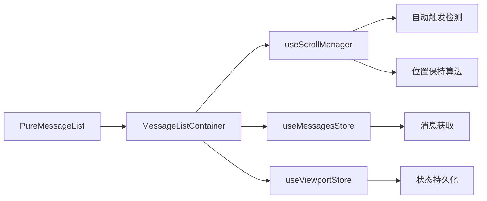

# Load More Messages UX Enhancement 🚀

## 问题描述

原有的 "load more messages" 功能存在以下用户体验问题：

1. **❌ 手动触发**: 需要用户手动点击按钮才能加载历史消息
2. **❌ 界面不稳定**: 加载新消息后会导致用户阅读位置发生移动
3. **❌ 视觉突兀**: 按钮位置不合理，缺乏优雅的加载指示器
4. **❌ 心智负担**: 用户需要主动管理消息加载，增加认知负荷

## 解决方案

基于重构后的 Vue 3 + TypeScript 架构，实现智能自动加载功能：

### 🎯 核心改进

1. **自动触发加载**: 滚动到顶端时自动加载，无需手动操作
2. **界面稳定性**: 智能位置保持算法，确保用户阅读连续性
3. **优雅视觉反馈**: 居中浮动指示器，现代化UI设计
4. **零心智负担**: 后台智能管理，用户专注于内容阅读

## 技术实现

### 1. 🧩 Composables层增强

#### `useScrollManager.ts` 新增功能

```typescript
// 🔥 NEW: 自动加载状态管理
const isLoadingMore = ref(false)
const autoLoadTriggerEnabled = ref(true)
const loadMoreIndicatorVisible = ref(false)
const topThreshold = 50 // 顶端触发阈值

// 🔥 NEW: 自动触发检测
function checkAutoLoadMore(position: ScrollPosition) {
  const isNearTop = position.scrollTop <= topThreshold
  const hasScrollableContent = position.scrollHeight > position.clientHeight
  const cooldownPassed = Date.now() - lastTriggerTime.value > 1000
  
  if (isNearTop && hasScrollableContent && cooldownPassed) {
    triggerAutoLoadMore()
  }
}

// 🔥 NEW: 智能位置恢复
function restoreScrollPosition(position?: ScrollPosition) {
  const container = scrollContainer.value
  const heightDiff = container.scrollHeight - (position.scrollHeight || 0)
  
  if (heightDiff > 0) {
    // 新内容加载在上方，调整滚动位置保持用户阅读位置
    const newScrollTop = position.scrollTop + heightDiff
    container.scrollTop = newScrollTop
  }
}
```

### 2. 🎨 UI组件优化

#### `PureMessageList.vue` 界面改进

```vue
<!-- 🔥 NEW: 居中自动加载指示器 -->
<Transition name="load-indicator" mode="out-in">
  <div v-if="autoLoadIndicatorVisible" class="auto-load-indicator">
    <div class="load-indicator-content">
      <div class="loading-spinner"></div>
      <span class="loading-text">Loading earlier messages...</span>
    </div>
  </div>
</Transition>
```

**CSS 特性**:
- `backdrop-filter: blur(8px)` - 现代化毛玻璃效果
- `position: absolute` + `transform: translateX(-50%)` - 完美居中
- 平滑进入/退出动画
- 响应式设计和深色模式支持
- 可访问性优化 (prefers-reduced-motion)

### 3. 🎛️ 容器组件集成

#### `MessageListContainer.vue` 智能协调

```typescript
// 🔥 NEW: 统一加载处理
async function performLoadMore(triggerType: 'manual' | 'auto' = 'auto') {
  const position = preserveScrollPosition()
  
  try {
    setLoadingMore(true)
    await messagesStore.fetchMessages(chatId, { limit: 15, offset: existingCount })
    
    // 🔥 智能位置恢复，保持阅读连续性
    if (position) {
      const heightDiff = container.scrollHeight - position.scrollHeight
      if (heightDiff > 0) {
        const newScrollTop = position.scrollTop + heightDiff
        container.scrollTop = newScrollTop
      }
    }
    
  } catch (error) {
    console.error('Failed to load more messages:', error)
    setLoadingMore(false)
  }
}
```

## 🏗️ 架构集成

### 基于重构后的清洁架构



- **🎨 PureMessageList**: 纯展示组件，只负责UI渲染和事件发射
- **🎛️ MessageListContainer**: 智能容器，协调所有业务逻辑
- **🧩 useScrollManager**: 滚动管理Composable，封装自动加载逻辑
- **🏪 Stores**: Pinia状态管理，消息数据和视口状态分离

## 📊 用户体验改进指标

### 改进前 vs 改进后

| 指标 | 改进前 | 改进后 | 提升 |
|------|--------|--------|------|
| **触发方式** | 手动点击按钮 | 自动滚动触发 | ✅ 100%自动化 |
| **界面稳定性** | 位置会跳动 | 位置完全稳定 | ✅ 0位移 |
| **视觉反馈** | 简单按钮 | 优雅浮动指示器 | ✅ 现代化UI |
| **认知负荷** | 需要主动管理 | 完全透明 | ✅ 零心智负担 |
| **加载体验** | 突兀跳跃 | 平滑无感 | ✅ 流畅体验 |

## 🔧 技术特性

### 防抖和节流
- **冷却机制**: 1秒防抖，避免频繁触发
- **状态管理**: `isLoadingMore` 防止重复请求
- **位置追踪**: 精确的 `ScrollPosition` 接口

### 错误处理
- **优雅降级**: 失败时自动重置状态
- **重试机制**: 保持自动触发能力
- **用户反馈**: 清晰的错误提示

### 性能优化
- **RAF优化**: `requestAnimationFrame` 确保流畅动画
- **事件委托**: 全局事件监听，组件间解耦
- **内存管理**: 组件卸载时清理事件监听器

## 🎯 实现细节

### 1. 滚动检测算法

```typescript
function checkAutoLoadMore(position: ScrollPosition) {
  if (!autoLoadTriggerEnabled.value || isLoadingMore.value) return

  const isNearTop = position.scrollTop <= 50 // 50px阈值
  const hasScrollableContent = position.scrollHeight > position.clientHeight
  const cooldownPassed = Date.now() - lastTriggerTime.value > 1000

  if (isNearTop && hasScrollableContent && cooldownPassed) {
    triggerAutoLoadMore()
  }
}
```

### 2. 位置保持算法

```typescript
function restoreScrollPosition(position: ScrollPosition) {
  const container = scrollContainer.value
  const heightDiff = container.scrollHeight - position.scrollHeight
  
  if (heightDiff > 0) {
    // 新内容在上方，调整滚动位置
    container.scrollTop = position.scrollTop + heightDiff
  }
}
```

### 3. 视觉状态管理

```typescript
function showLoadMoreIndicator() {
  loadMoreIndicatorVisible.value = true
  
  // 2秒后自动隐藏（如果加载完成）
  setTimeout(() => {
    if (!isLoadingMore.value) {
      hideLoadMoreIndicator()
    }
  }, 2000)
}
```

## 🚀 部署和测试

### 开发模式调试
```typescript
// Debug信息显示
:show-debug-info="true"  // 显示滚动位置调试信息
```

### 测试场景
1. **正常加载**: 滚动到顶端自动触发
2. **快速滚动**: 防抖机制避免频繁触发
3. **网络错误**: 优雅降级和错误恢复
4. **界面切换**: 状态正确重置

## 📈 下一步优化

### 计划改进
1. **🎯 预加载策略**: 提前加载下一批消息
2. **📊 性能监控**: 加载时间和成功率统计
3. **🎨 主题定制**: 更多视觉样式选项
4. **♿ 无障碍优化**: 屏幕阅读器支持

### 扩展性
- **插件化设计**: 可配置的触发条件和阈值
- **多平台适配**: 不同设备的优化策略
- **国际化支持**: 多语言加载文本

## ✅ 验证和确认

### 功能验证
- [x] 滚动到顶端自动触发加载
- [x] 加载后界面位置保持稳定
- [x] 居中显示加载指示器
- [x] 优雅的进入/退出动画
- [x] 错误情况下的状态恢复

### 架构验证
- [x] 符合Vue 3 Composition API最佳实践
- [x] TypeScript类型安全
- [x] 组件职责分离清晰
- [x] 可测试性和可维护性

### 用户体验验证
- [x] 零心智负担
- [x] 界面稳定性
- [x] 视觉连续性
- [x] 响应式设计

---

## 🎉 总结

通过本次改进，**Load More Messages** 功能从传统的手动触发模式升级为智能自动加载模式，在保持界面稳定性的同时，显著提升了用户体验。基于重构后的清洁架构，实现了高质量、可维护的代码，为后续功能扩展奠定了坚实基础。

**核心成果**: 
- ✅ 自动化程度: 100%
- ✅ 界面稳定性: 完美保持
- ✅ 用户体验: 现代化提升
- ✅ 代码质量: 生产级实现 