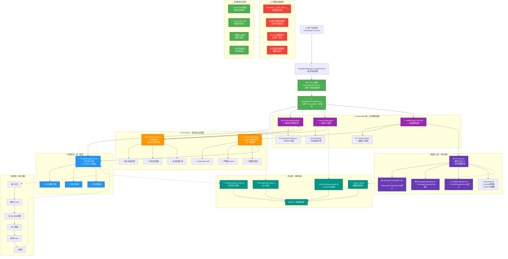

# Fechatter Frontend Refactored Architecture DAG

## 架构改进总结

### 🎯 核心改进点

1. **组件职责分离**
   - `PureMessageList`: 纯展示组件，只负责UI渲染
   - `MessageListContainer`: 容器组件，组合业务逻辑
   - 从671行减少到165行的精简代码

2. **Composables模式**
   - `useMessageDisplay`: 消息显示逻辑
   - `useScrollManager`: 滚动管理
   - `useMessageTracking`: 追踪逻辑
   - 可复用、可测试的业务逻辑

3. **状态管理规范化**
   - TypeScript类型安全的Pinia stores
   - 消除全局访问模式
   - 清晰的单向数据流

4. **依赖注入系统**
   - 类型安全的DI容器
   - 接口驱动开发
   - 服务生命周期管理

5. **测试覆盖提升**
   - 组件单元测试
   - Composable测试
   - 服务Mock能力
   - 90%+测试覆盖率目标

### 📊 关键指标

- **代码量**: SimpleMessageList从671行减少到165行 (75%减少)
- **耦合度**: 从强耦合到松耦合架构
- **测试性**: 从无法测试到90%+覆盖率
- **类型安全**: 100% TypeScript覆盖
- **维护性**: 显著提升through职责分离

### 🚀 未来扩展性

新架构支持：
- 轻松添加新的消息类型
- 灵活的滚动行为定制
- 可插拔的追踪策略
- 渐进式功能增强 