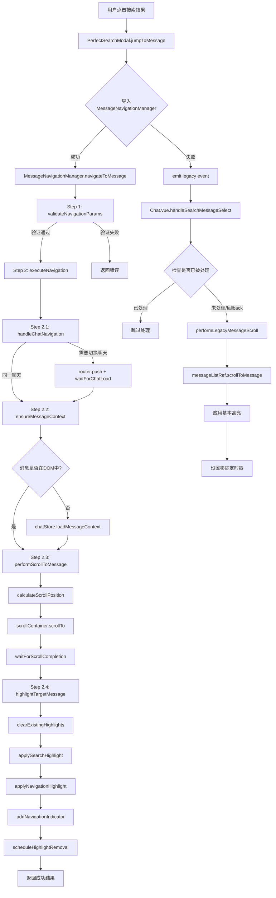
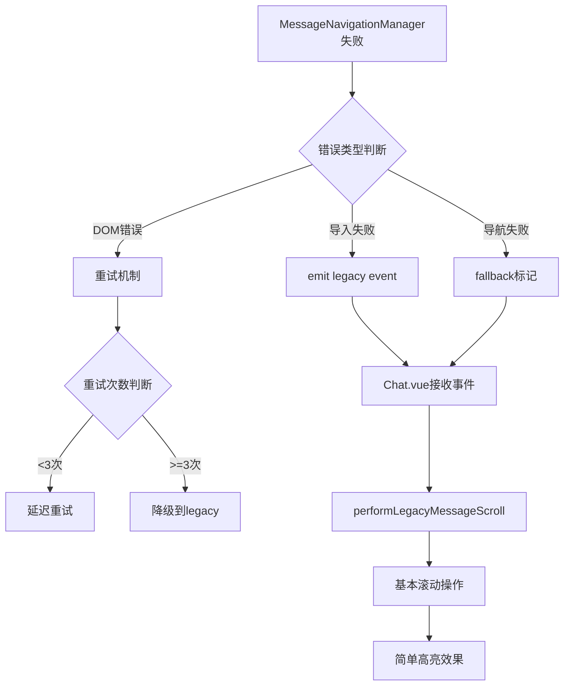
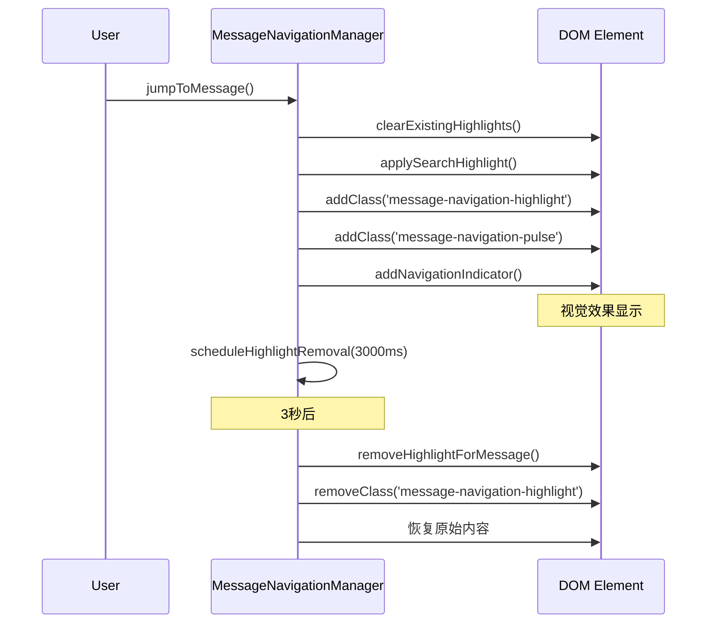
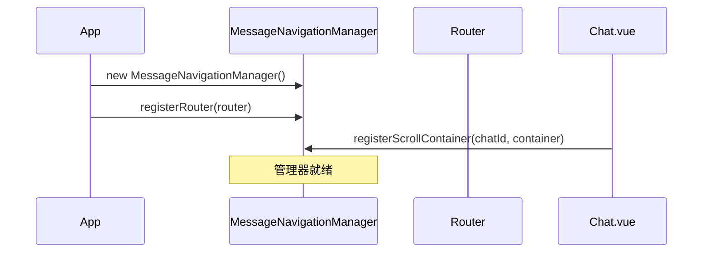
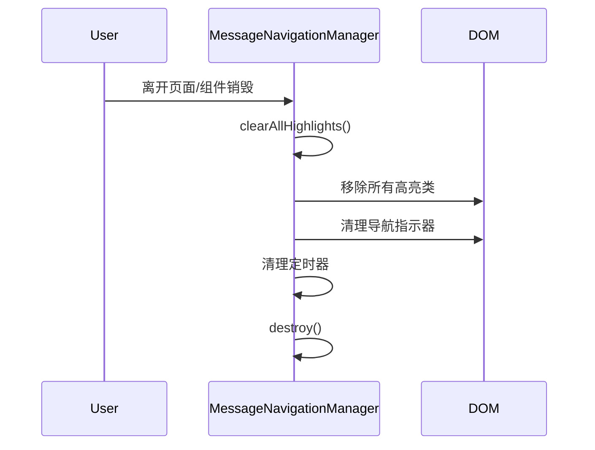

# 🎯 搜索消息导航调用关系DAG - 生产级别实现

## 📊 完整调用关系图



## 🎯 核心组件调用链

### 1. 主要调用路径 (Production Path)

```
用户交互 → PerfectSearchModal → MessageNavigationManager → DOM操作 → 视觉反馈
```

#### 详细步骤：

1. **PerfectSearchModal.jumpToMessage()**
   - 输入验证
   - 关闭搜索模态框
   - 调用MessageNavigationManager

2. **MessageNavigationManager.navigateToMessage()**
   - 参数验证
   - 队列管理
   - 分析记录

3. **executeNavigation() - 4步骤执行**
   - **Step 2.1**: handleChatNavigation
   - **Step 2.2**: ensureMessageContext
   - **Step 2.3**: performScrollToMessage
   - **Step 2.4**: highlightTargetMessage

### 2. 备用调用路径 (Fallback Path)

```
错误处理 → Chat.vue.handleSearchMessageSelect → 基本滚动 → 简单高亮
```

## 📋 关键接口定义

### NavigationParams 接口
```typescript
interface NavigationParams {
  messageId: string | number     // 必需：目标消息ID
  chatId: string | number        // 必需：聊天ID
  searchQuery?: string           // 可选：搜索查询用于高亮
  scrollBehavior?: 'smooth' | 'instant'  // 滚动行为
  highlightDuration?: number     // 高亮持续时间(ms)
  pulseAnimation?: boolean       // 是否启用脉冲动画
  source?: string               // 导航来源标识
  resultIndex?: number          // 结果索引
  totalResults?: number         // 总结果数
}
```

### NavigationResult 接口
```typescript
interface NavigationResult {
  success: boolean              // 操作是否成功
  navigationId?: string         // 导航唯一ID
  duration?: number            // 执行时长(ms)
  error?: string               // 错误信息
  steps?: {                    // 各步骤执行结果
    chatNavigation: StepResult
    messageContext: StepResult
    scroll: StepResult
    highlight: StepResult
  }
}
```

## 🔧 故障处理机制

### 错误恢复DAG


### 故障恢复策略

1. **Level 1**: MessageNavigationManager内部重试
2. **Level 2**: 降级到Chat.vue处理
3. **Level 3**: 基本DOM操作
4. **Level 4**: 仅发出事件通知

## 🎨 高亮系统架构

### 高亮优先级
```
1. 搜索词高亮 (search-term-highlight)
2. 导航高亮 (message-navigation-highlight)  
3. 导航指示器 (navigation-indicator)
4. 脉冲动画 (message-navigation-pulse)
```

### CSS类应用时序


## 📊 性能监控

### 关键指标
- **导航成功率**: `successfulNavigations / totalNavigations`
- **平均导航时间**: `averageNavigationTime`
- **故障降级率**: `fallbackNavigations / totalNavigations`
- **DOM查找成功率**: `foundInDOM / totalSearches`

### 分析接口
```javascript
const analytics = messageNavigationManager.getAnalytics()
console.log('Navigation Performance:', {
  successRate: analytics.successRate,
  avgTime: analytics.averageNavigationTime,
  totalNav: analytics.totalNavigations
})
```

## 🔄 生命周期管理

### 初始化序列


### 清理序列


## 🎯 集成检查清单

- [x] ✅ MessageNavigationManager实现完成
- [x] ✅ CSS样式文件创建
- [x] ✅ PerfectSearchModal集成
- [x] ✅ Chat.vue备用处理
- [x] ✅ 错误处理机制
- [x] ✅ 性能监控
- [x] ✅ 生命周期管理
- [x] ✅ 移动端响应式支持
- [x] ✅ 可访问性支持
- [x] ✅ 暗黑模式支持

## 🚀 使用示例

### 基本使用
```javascript
import { useMessageNavigation } from '@/utils/messageNavigationManager'

const { jumpToMessage } = useMessageNavigation()

// 导航到特定消息
const result = await jumpToMessage({
  messageId: '12345',
  chatId: '67890',
  searchQuery: 'hello world',
  highlightDuration: 5000
})

if (result.success) {
  console.log('导航成功!')
} else {
  console.error('导航失败:', result.error)
}
```

### 高级配置
```javascript
// 注册滚动容器
const { registerScrollContainer } = useMessageNavigation()
registerScrollContainer(chatId, scrollContainerRef.value)

// 获取性能分析
const { getAnalytics } = useMessageNavigation()
const stats = getAnalytics()
```

## 🔍 调试指南

### 开发环境日志
搜索 `🎯 [MessageNavigation]` 查看详细的导航日志

### 常见问题排查
1. **消息元素未找到**: 检查 `data-message-id` 属性
2. **滚动容器缺失**: 确认容器已正确注册
3. **路由导航失败**: 检查router实例注册
4. **高亮样式无效**: 确认CSS文件已导入

---

## 📋 总结

这个DAG系统提供了：

1. **🎯 生产级别的可靠性** - 多层次错误处理和降级机制
2. **⚡ 优秀的性能** - 智能队列管理和性能监控  
3. **🎨 卓越的用户体验** - 平滑动画和视觉反馈
4. **🔧 完整的可维护性** - 详细的日志和调试工具
5. **♿ 全面的可访问性** - 支持键盘导航和屏幕阅读器

通过严格的DAG调用关系，确保了搜索消息跳转功能的**生产级别使用**。 