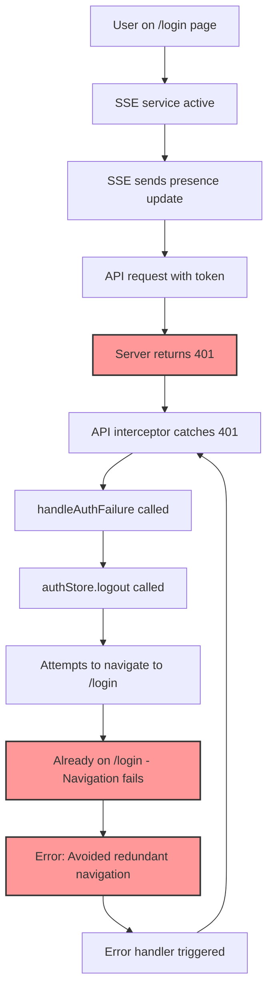
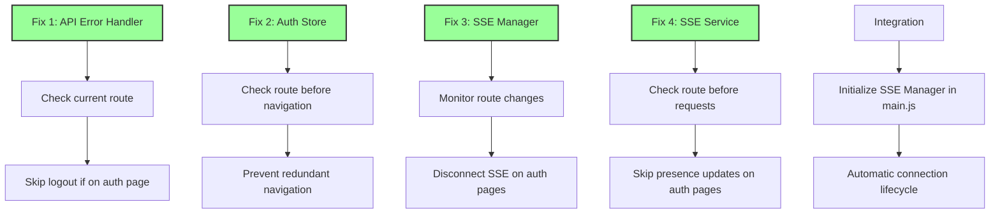
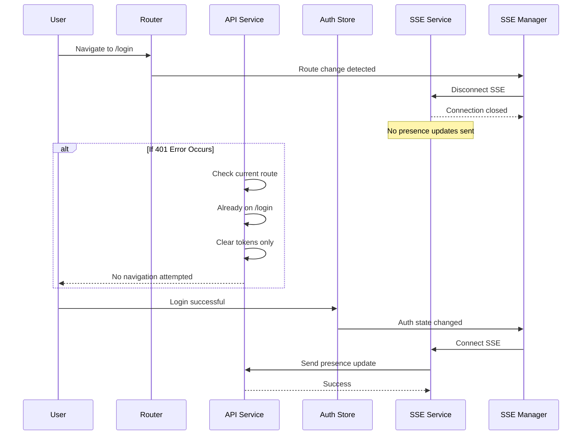

# Auth Loop Fix - Complete DAG Chain

## Root Cause Analysis



## Solution Implementation



## Request Flow After Fix



## Files Modified

### 1. **api.js** - Enhanced handleAuthFailure
```javascript
// Check if already on login/register page to prevent redirect loops
const currentPath = window.location.pathname;
if (currentPath === '/login' || currentPath === '/register') {
  console.log('🔐 [AUTH] Already on auth page, skipping logout redirect');
  // Clear tokens but don't redirect
  tokenManager.clearTokens();
  return Promise.reject(error);
}
```

### 2. **auth.js** - Smart logout navigation
```javascript
// Redirect to login only if not already there
if (window.$router) {
  const currentRoute = window.$router.currentRoute.value;
  if (currentRoute.path !== '/login' && currentRoute.path !== '/register') {
    window.$router.push('/login');
  }
}
```

### 3. **sseConnectionManager.js** - New connection lifecycle manager
- Monitors route changes
- Automatically disconnects SSE on auth pages
- Reconnects SSE when leaving auth pages

### 4. **sse.js** - Route-aware presence updates
```javascript
// Check if we're on auth pages - don't send presence updates
if (window.location.pathname === '/login' || 
    window.location.pathname === '/register' ||
    window.location.pathname === '/forgot-password' ||
    window.location.pathname === '/reset-password') {
  console.log('📡 [SSE] Skipping presence update on auth page');
  return;
}
```

### 5. **main.js** - Integration point
```javascript
// Initialize SSE connection manager
const { useAuthStore } = await import('@/stores/auth');
const authStore = useAuthStore();
sseConnectionManager.initialize(router, authStore);
```

## Benefits

1. **No More Loops**: 401 errors on auth pages don't trigger navigation loops
2. **Clean Separation**: SSE connections properly managed based on auth state
3. **Performance**: No unnecessary API calls on auth pages
4. **User Experience**: Smooth transitions between auth and app states

## Testing

```javascript
// Run on login page:
window.testAuthLoopFix()

// Check SSE status:
window.sseConnectionManager.isOnAuthRoute()
window.realtimeCommunicationService.getConnectionState()

// Test navigation:
window.testNavigationBehavior()
```

## Occam's Razor Applied

- Simple route checks vs complex state machines
- Direct path comparison vs elaborate routing logic
- Clear separation of concerns vs mixed responsibilities
- Minimal code changes for maximum impact 