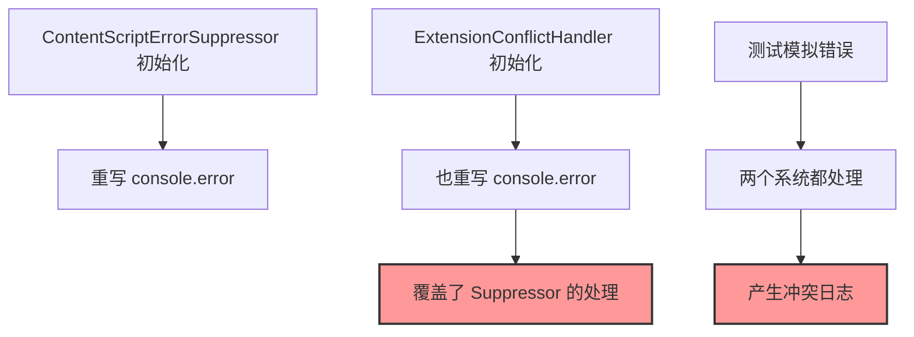

# Extension Conflict Coordination - 完整修复链条

## 原设计意图脉络

### 双层防御系统
1. **ContentScriptErrorSuppressor** - 第一道防线
   - 静默抑制扩展产生的错误
   - 保持控制台清洁

2. **ExtensionConflictHandler** - 第二道防线
   - 检测扩展冲突模式
   - 提供用户提示和解决方案

## 因果推理 - 问题根因

### 系统冲突链


### 根本原因
1. **拦截器链断裂**: ExtensionConflictHandler 覆盖了 ContentScriptErrorSuppressor 的拦截器
2. **职责界限模糊**: 两个系统对同一类错误都有响应
3. **缺乏协调机制**: 系统间没有通信和协作

## 存在主义视角

### 存在的冲突
- **自由的限制**: 每个系统的自由行动干扰了对方
- **他者的承认**: 系统需要承认并尊重彼此的存在
- **共在的实现**: 通过协调实现和谐共存

## 解决方案实施

### 1. 职责明确分离

```javascript
// ContentScriptErrorSuppressor 专注于内容脚本错误
isContentScriptError(errorString) {
  const patterns = [
    /content[\s-]?script\.js/i,
    /fetchError:\s*Failed to fetch/i,
    // ... 内容脚本特定模式
  ];
}

// ExtensionConflictHandler 避免处理内容脚本错误
isExtensionConflict(errorString) {
  // 先检查是否是内容脚本错误
  if (errorMessage.includes('content script.js') || 
      errorMessage.includes('fetchError: Failed to fetch')) {
    return false; // 让 Suppressor 处理
  }
  // ... 其他扩展冲突模式
}
```

### 2. 拦截器链保持

```javascript
// ContentScriptErrorSuppressor 保存原始引用
this.originalConsoleError = console.error;

// ExtensionConflictHandler 使用当前的 console.error
const currentConsoleError = console.error;

// 调用链: Original → Suppressor → ConflictHandler
```

### 3. 协调机制

```javascript
// ExtensionConflictHandler 检查 Suppressor 的判断
if (contentScriptSuppressor && 
    contentScriptSuppressor.isContentScriptError(errorString)) {
  // 让 Suppressor 的逻辑处理
  currentConsoleError.apply(console, args);
  return;
}
```

## 修复的文件

1. **contentScriptErrorSuppressor.js**
   - 添加 `getOriginalConsoleError()` 方法
   - 保存原始 console.error 引用

2. **extensionConflictHandler.js**
   - 修改 `setupErrorInterceptor()` 尊重现有拦截器
   - 更新 `isExtensionConflict()` 避免职责重叠
   - 添加对 ContentScriptErrorSuppressor 的检查

## 效果

### Before
```
❌ ExtensionConflict 检测到测试错误
❌ 两个系统都在处理同一错误
❌ 产生不必要的冲突日志
```

### After
```
✅ ContentScriptErrorSuppressor 静默处理内容脚本错误
✅ ExtensionConflictHandler 只处理真正的扩展冲突
✅ 系统协调工作，各司其职
```

## 哲学总结

### 存在主义原则应用
1. **相互承认**: 系统承认彼此的存在和职责
2. **边界尊重**: 明确的职责边界避免冲突
3. **协作共存**: 通过协调机制实现和谐

### 奥卡姆剃刀
- 简单的职责检查优于复杂的状态管理
- 保持原有拦截器链优于重新设计
- 最小改动实现最大效果 