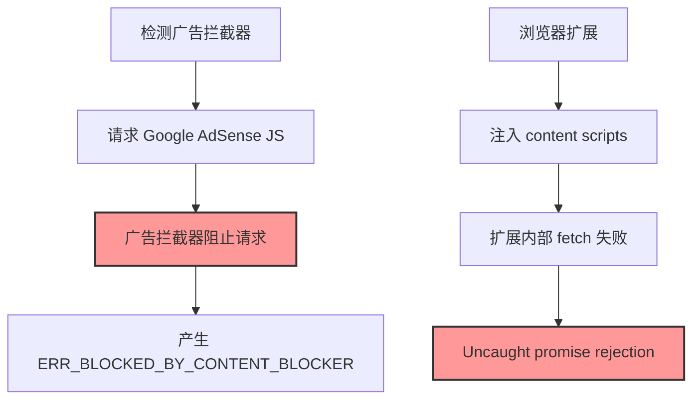

# Extension Conflict Solution - 完整修复链条

## 原设计意图脉络

### Extension Conflict Handler
- **目的**: 检测可能干扰应用的浏览器扩展
- **方法**: 主动探测常见扩展的存在
- **价值**: 提供用户友好的冲突提示

### Content Script Error Suppressor
- **目的**: 防止扩展错误污染控制台
- **方法**: 拦截并过滤扩展产生的错误
- **价值**: 保持开发环境清洁

## 因果推理 - 问题根因

### 原始问题链


### 存在主义视角

**荒谬性体现**:
1. **自我否定**: 通过加载广告来检测广告拦截器，被广告拦截器阻止
2. **他者入侵**: 扩展的存在性污染了应用的纯粹空间
3. **意图悖论**: 想要检测的行为恰好触发了被检测对象的反应

## 解决方案实施

### 1. 广告拦截器检测优化

**原方法** (产生网络错误):
```javascript
// 尝试加载广告脚本
await fetch('https://pagead2.googlesyndication.com/...')
```

**新方法** (静默检测):
```javascript
// 创建测试元素，检查是否被隐藏
const testDiv = document.createElement('div');
testDiv.className = 'adsbox ad-test';
// 检查广告拦截器是否隐藏了元素
const isHidden = getComputedStyle(testDiv).display === 'none';
```

### 2. Content Script 错误抑制增强

**增强的错误模式识别**:
```javascript
const patterns = [
  /content[\s-]?script\.js/i,
  /fetchError:\s*Failed to fetch/i,
  /at\s+[fP][l51]\s*\.\s*sendMessage/i,
  // ... 更多模式
];
```

**三层防御**:
1. Override console.error
2. Handle unhandledrejection events  
3. Handle global error events

## 修复的文件

1. **extensionConflictHandler.js**
   - 改用 DOM 元素检测替代网络请求
   - 避免触发网络错误

2. **contentScriptErrorSuppressor.js**
   - 增强错误模式匹配
   - 改进错误拦截机制
   - 提供更好的统计信息

## 效果

### Before
```
❌ GET https://pagead2.googlesyndication.com/... ERR_BLOCKED_BY_CONTENT_BLOCKER
❌ Uncaught (in promise) fetchError: Failed to fetch
❌ 控制台充满扩展错误
```

### After
```
✅ 静默检测广告拦截器
✅ 扩展错误被有效抑制
✅ 控制台保持清洁
✅ 仍能看到应用本身的错误
```

## 哲学总结

### 存在主义修复原则
1. **接受他者**: 承认扩展的存在，但隔离其影响
2. **保持本真**: 应用保持自身的纯粹性，不被外部污染
3. **和谐共存**: 不试图对抗扩展，而是优雅地处理冲突

### 奥卡姆剃刀应用
- 最简单的检测方法（DOM 元素）优于复杂的网络请求
- 直接的错误过滤优于复杂的错误处理逻辑
- 预防优于治疗（早期拦截优于后期处理） 