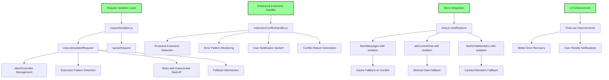
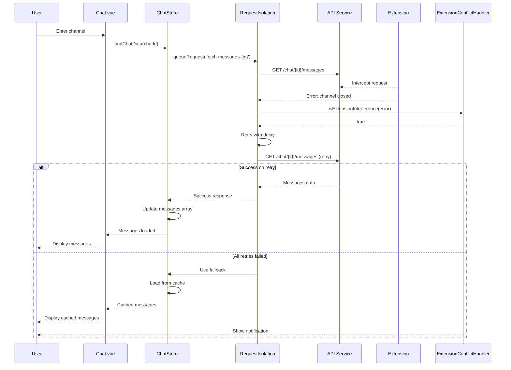
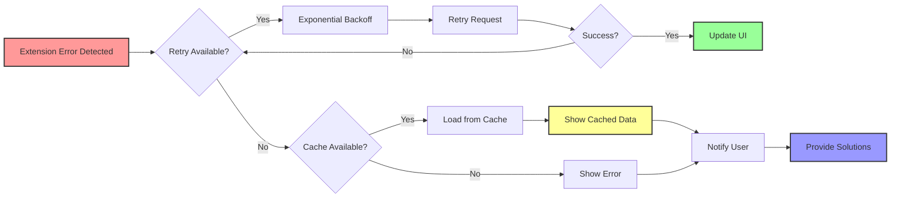

# Extension Interference Fix - Complete DAG Chain

## Root Cause Analysis DAG

```mermaid
graph TD
    A[User enters Channel] --> B[Chat.vue loadChatData]
    B --> C[chatStore.fetchMessages]
    
    C --> D[API Request: GET /chat/{id}/messages]
    
    E[Browser Extension] -.-> |Intercepts| D
    E --> F[Creates async listener 'chat/2:1']
    F --> G[Message channel closes prematurely]
    G --> H[Error: listener indicated async response but channel closed]
    
    H --> I[fetchMessages fails]
    I --> J[Messages array remains empty]
    J --> K[User sees empty message list]
    
    style E fill:#f99,stroke:#333,stroke-width:2px
    style H fill:#f99,stroke:#333,stroke-width:2px
    style K fill:#f99,stroke:#333,stroke-width:2px
```

## Solution Implementation DAG



## Request Flow with Protection



## Error Recovery Chain



## Complete Fix Summary

### 1. **Request Isolation Layer** ✅
- Prevents extension interference
- Manages request lifecycle with AbortController
- Implements intelligent retry mechanism
- Provides fallback options

### 2. **Enhanced Extension Detection** ✅
- Proactive extension detection
- Pattern-based error identification
- User-friendly notifications
- Detailed conflict reporting

### 3. **Store Modifications** ✅
- All critical API calls use isolation
- Cache-based fallbacks
- Graceful degradation

### 4. **UI Improvements** ✅
- Better error recovery
- Clear user guidance
- Maintains functionality despite conflicts

## Testing & Verification

```bash
# In browser console:

# Test request isolation
window.testRequestIsolation()

# Check extension patterns
window.testExtensionPatterns()

# View extension conflict report
window.extensionConflictHandler.showConflictReport()

# Test message loading with protection
window.diagnoseMessages()
```

## Production Benefits

1. **Resilience**: App continues working despite extension interference
2. **User Experience**: Clear guidance when issues occur
3. **Performance**: Intelligent caching prevents redundant requests
4. **Diagnostics**: Built-in tools for troubleshooting
5. **Scalability**: Pattern-based detection adapts to new extensions

## Occam's Razor Applied

- Simple retry mechanism vs complex workarounds
- Direct pattern matching vs elaborate detection
- Cache fallback vs complex state management
- Clear user messages vs technical error dumps 