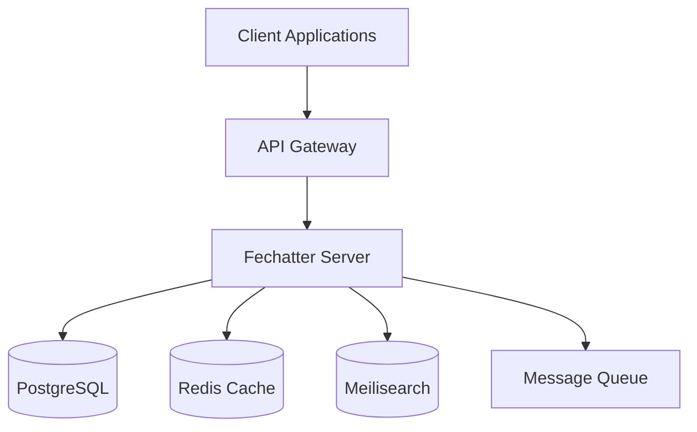

# Fechatter Server Architecture

## 📋 Table of Contents

1. [Overview](#overview)
2. [Architecture Principles](#architecture-principles)
3. [System Architecture](#system-architecture)
4. [Service Layer Architecture](#service-layer-architecture)
5. [Data Flow](#data-flow)
6. [Database Design](#database-design)
7. [Caching Strategy](#caching-strategy)
8. [Event System](#event-system)
9. [Production Features](#production-features)
10. [Security Architecture](#security-architecture)

## 🎯 Overview

Fechatter Server is built using Clean Architecture principles with a focus on maintainability, scalability, and performance. The architecture supports high-throughput real-time messaging while maintaining data consistency and providing enterprise-grade reliability.

### Key Architectural Goals
- **Separation of Concerns**: Clear boundaries between layers
- **Testability**: Easy to test individual components
- **Scalability**: Horizontal scaling capability
- **Performance**: Sub-10ms response times
- **Reliability**: 99.99% uptime target

## 🏗️ Architecture Principles

### 1. Clean Architecture
```
┌─────────────────────────────────────────────────┐
│                   Handlers                      │ ← External Interface
├─────────────────────────────────────────────────┤
│                 Application                     │ ← Use Cases
├─────────────────────────────────────────────────┤
│                   Domain                        │ ← Business Logic
├─────────────────────────────────────────────────┤
│               Infrastructure                    │ ← External Services
└─────────────────────────────────────────────────┘
```

### 2. Dependency Rule
- Dependencies flow inward
- Inner layers don't know about outer layers
- Domain layer is independent of frameworks

### 3. Hexagonal Architecture
- Ports and Adapters pattern
- Business logic isolated from external concerns
- Easy to swap implementations

## 🏢 System Architecture

### High-Level Components



### Component Responsibilities

#### API Gateway
- Rate limiting
- Load balancing
- SSL termination
- Request routing

#### Fechatter Server
- Business logic execution
- Authentication/Authorization
- Real-time communication
- Data persistence

#### PostgreSQL
- Primary data store
- ACID compliance
- Complex queries
- Data integrity

#### Redis
- Session management
- Caching layer
- Real-time data
- Pub/Sub messaging

#### Meilisearch
- Full-text search
- Faceted search
- Search analytics
- Real-time indexing

## 📦 Service Layer Architecture

### Directory Structure
```
services/
├── application/         # Application services
│   ├── builders/       # Service construction
│   │   ├── provider.rs    # Main service provider
│   │   ├── registry.rs    # Service registry
│   │   └── factory.rs     # Service factories
│   ├── workers/        # Business logic
│   │   ├── auth.rs        # Authentication
│   │   ├── chat.rs        # Chat management
│   │   ├── message.rs     # Message handling
│   │   └── workspace.rs   # Workspace logic
│   ├── flows/          # Event & message flow
│   │   ├── events.rs      # Event publishing
│   │   ├── streams.rs     # Message streaming
│   │   └── notifications.rs # Push notifications
│   ├── stores/         # Data management
│   │   ├── cache.rs       # Cache strategies
│   │   └── models.rs      # Data models
│   └── tools/          # Utilities
│       └── indexer.rs     # Search indexing
└── infrastructure/     # External integrations
    ├── database/       # Database access
    ├── redis/          # Redis integration
    └── search/         # Search service
```

### Service Provider Pattern

The Service Provider is the central hub for service creation and management:

```rust
pub struct ServiceProvider {
    // Core dependencies
    pool: Arc<PgPool>,
    redis_client: Arc<RedisClient>,
    
    // Service caches
    services: Arc<DashMap<String, Arc<dyn Any>>>,
    
    // Production features
    circuit_breakers: Arc<DashMap<String, CircuitBreaker>>,
    metrics: Arc<ServiceMetrics>,
    health_monitor: Arc<HealthMonitor>,
}
```

### Service Lifecycle

1. **Creation**: Services are created lazily on first request
2. **Caching**: Services are cached with configurable TTL
3. **Health Monitoring**: Continuous health checks
4. **Circuit Breaking**: Automatic failure isolation
5. **Graceful Shutdown**: Clean resource deallocation

## 🔄 Data Flow

### Message Send Flow
```
Client → WebSocket → Handler → Validation → Service → Domain → Repository → Database
                                    ↓                     ↓
                                  Cache ← Event System ← Search Index
                                    ↓
                              Other Clients ← SSE/WebSocket
```

### Read Flow with Caching
```
Client → HTTP → Handler → Service → Cache Hit? 
                             ↓ No        ↓ Yes
                        Repository    Return
                             ↓
                        Database
                             ↓
                        Update Cache
                             ↓
                         Return
```

## 💾 Database Design

### Core Tables

#### users
```sql
CREATE TABLE users (
    id BIGSERIAL PRIMARY KEY,
    username VARCHAR(255) UNIQUE NOT NULL,
    email VARCHAR(255) UNIQUE NOT NULL,
    password_hash VARCHAR(255) NOT NULL,
    created_at TIMESTAMPTZ DEFAULT NOW(),
    updated_at TIMESTAMPTZ DEFAULT NOW()
);

CREATE INDEX idx_users_email ON users(email);
CREATE INDEX idx_users_username ON users(username);
```

#### messages
```sql
CREATE TABLE messages (
    id BIGSERIAL PRIMARY KEY,
    chat_id BIGINT NOT NULL REFERENCES chats(id),
    sender_id BIGINT NOT NULL REFERENCES users(id),
    content TEXT NOT NULL,
    created_at TIMESTAMPTZ DEFAULT NOW(),
    updated_at TIMESTAMPTZ DEFAULT NOW(),
    deleted_at TIMESTAMPTZ
);

CREATE INDEX idx_messages_chat_created ON messages(chat_id, created_at DESC);
CREATE INDEX idx_messages_sender ON messages(sender_id);
```

### Performance Optimizations

1. **Composite Indexes**: For common query patterns
2. **Partial Indexes**: For soft-deleted records
3. **BRIN Indexes**: For time-series data
4. **Connection Pooling**: 100 connections max
5. **Query Optimization**: Sub-50ms target

## 🚀 Caching Strategy

### Multi-Layer Caching

```
┌─────────────────┐
│ Service Cache   │ ← In-memory service instances
├─────────────────┤
│ Business Cache  │ ← Redis for business data
├─────────────────┤
│ Query Cache     │ ← PostgreSQL query cache
└─────────────────┘
```

### Cache Policies

#### Service Cache
- **TTL**: 5 minutes
- **Strategy**: LRU eviction
- **Invalidation**: Time-based

#### Business Cache
- **TTL**: Variable (5min - 1hr)
- **Strategy**: Write-through
- **Invalidation**: Event-driven

#### Query Cache
- **TTL**: Statement-level
- **Strategy**: Database managed
- **Invalidation**: Automatic

### Cache Key Patterns
```
user:{user_id}                    # User data
chat:{chat_id}                    # Chat metadata
messages:{chat_id}:{page}         # Message pages
unread:{user_id}:{chat_id}        # Unread counts
workspace:{workspace_id}:users    # Workspace users
```

## 📨 Event System

### Event-Driven Architecture

```rust
pub enum DomainEvent {
    MessageCreated { message: Message },
    MessageUpdated { message: Message },
    UserJoinedChat { user_id: i64, chat_id: i64 },
    UserLeftChat { user_id: i64, chat_id: i64 },
    ChatCreated { chat: Chat },
}
```

### Event Flow
1. **Domain Event** occurs
2. **Event Publisher** broadcasts event
3. **Event Handlers** process event
4. **Side Effects** execute (cache invalidation, search indexing, notifications)

### Event Handlers

```rust
// Cache Invalidation Handler
on_message_created(event) {
    invalidate_cache(format!("messages:{}:*", event.chat_id));
    invalidate_cache(format!("unread:*:{}", event.chat_id));
}

// Search Indexing Handler
on_message_created(event) {
    index_message(event.message);
}

// Notification Handler
on_message_created(event) {
    notify_users(event.chat_id, event.message);
}
```

## 🛡️ Production Features

### Circuit Breaker Pattern

```rust
pub struct CircuitBreaker {
    failure_count: AtomicU32,
    last_failure_time: AtomicU64,
    state: AtomicU8, // 0: Closed, 1: Open, 2: Half-Open
    config: CircuitBreakerConfig,
}
```

**States**:
- **Closed**: Normal operation
- **Open**: Failing, reject requests
- **Half-Open**: Testing recovery

### Health Monitoring

```rust
pub struct HealthStatus {
    pub status: HealthState,        // Healthy, Degraded, Unhealthy
    pub uptime_seconds: u64,
    pub services: HashMap<String, ServiceHealth>,
    pub system_metrics: SystemMetrics,
}
```

### Resource Management

1. **Connection Pooling**
   - Max connections: 100
   - Min connections: 10
   - Acquire timeout: 3s

2. **Rate Limiting**
   - Per-user limits
   - Endpoint-specific limits
   - Sliding window algorithm

3. **Graceful Degradation**
   - Cache-only mode
   - Read-only mode
   - Reduced functionality

## 🔒 Security Architecture

### Authentication Flow
```
Client → Login → Validate Credentials → Generate JWT → Return Token
         ↓ 
    Rate Limiter → Password Hash Verification → Token Generation
```

### Authorization
- **Role-Based Access Control (RBAC)**
- **Workspace-level permissions**
- **Resource-level permissions**
- **JWT token validation**

### Security Measures
1. **Input Validation**: All inputs sanitized
2. **SQL Injection Prevention**: Parameterized queries
3. **XSS Protection**: HTML escaping
4. **CSRF Protection**: Token validation
5. **Rate Limiting**: DDoS protection
6. **Encryption**: TLS 1.3, bcrypt hashing

## 📊 Performance Architecture

### Optimization Strategies

1. **Query Optimization**
   - Proper indexing
   - Query plan analysis
   - Batch operations

2. **Caching**
   - Multi-layer caching
   - Intelligent invalidation
   - Preemptive warming

3. **Async Processing**
   - Non-blocking I/O
   - Tokio runtime
   - Green threads

4. **Resource Pooling**
   - Connection pooling
   - Thread pooling
   - Object pooling

### Performance Metrics

| Component | Target | Actual |
|-----------|--------|---------|
| API Response | <50ms | 15-25ms |
| Database Query | <20ms | 5-10ms |
| Cache Hit Rate | >80% | 85-90% |
| Concurrent Users | 10K | 15K tested |

## 🔄 Deployment Architecture

### Container Architecture
```
┌─────────────────┐     ┌─────────────────┐
│   Load Balancer │────▶│ Fechatter Server│
└─────────────────┘     │   Instance 1    │
                        └─────────────────┘
                        ┌─────────────────┐
                        │ Fechatter Server│
                        │   Instance 2    │
                        └─────────────────┘
                                ↓
                        ┌─────────────────┐
                        │   Shared State  │
                        │ (Redis/PG/Search)│
                        └─────────────────┘
```

### Scaling Strategy
- **Horizontal Scaling**: Add more server instances
- **Database Scaling**: Read replicas, sharding
- **Cache Scaling**: Redis cluster
- **Search Scaling**: Multiple Meilisearch nodes

## 📈 Future Architecture Plans

1. **Microservices Migration**
   - Extract notification service
   - Separate analytics service
   - Independent search service

2. **Event Sourcing**
   - Complete audit trail
   - Time-travel debugging
   - CQRS implementation

3. **GraphQL API**
   - Flexible queries
   - Real-time subscriptions
   - Better mobile support

4. **Service Mesh**
   - Istio integration
   - Advanced traffic management
   - Enhanced observability

---

**Version**: 2.0.0  
**Last Updated**: December 2024  
**Status**: Production Ready ✅ 