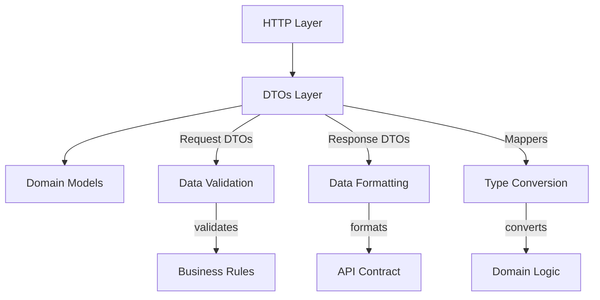

# DTOs Architecture Summary

## 📁 DTOs Directory Structure

```
src/dtos/
├── mod.rs                      # 📋 模块导出和集成
│
├── core/                       # 🧠 核心功能框架
│   ├── mod.rs                 # 核心trait定义 (BaseDto, RequestDto, ResponseDto)
│   ├── conversion.rs          # 类型转换和错误处理
│   ├── validation.rs          # 数据验证框架
│   ├── response.rs            # 统一响应格式
│   └── pagination.rs          # 分页处理
│
├── models/                     # 📦 具体DTO实现
│   ├── requests/              # 📥 请求DTOs
│   │   ├── auth.rs           # 🔐 认证请求 (Login, Register, RefreshToken)
│   │   ├── chat.rs           # 💬 聊天请求 (CreateChat, UpdateChat, JoinChat)
│   │   ├── message.rs        # 📧 消息请求 (SendMessage, EditMessage, DeleteMessage)
│   │   ├── user.rs           # 👤 用户请求 (UpdateProfile, ChangePassword)
│   │   ├── workspace.rs      # 🏢 工作空间请求 (CreateWorkspace, InviteUser)
│   │   └── mod.rs            # 请求DTOs导出
│   │
│   └── responses/             # 📤 响应DTOs
│       ├── auth.rs           # 🔐 认证响应 (AuthResponse, TokenResponse)
│       ├── message.rs        # 📧 消息响应 (MessageResponse, MessageListResponse)
│       ├── common.rs         # 🌐 通用响应 (ApiResponse, ErrorResponse, SuccessResponse)
│       └── mod.rs            # 响应DTOs导出
│
└── mappers/                    # 🔄 数据映射器
    ├── user_mappers.rs        # 👤 用户数据映射
    ├── chat_mappers.rs        # 💬 聊天数据映射
    ├── message_mappers.rs     # 📧 消息数据映射
    └── mod.rs                 # 映射器导出
```

## 🎯 Architecture Principles

### 1. Clean Architecture Compliance


### 2. Data Flow Pattern
```rust
// HTTP Request → Request DTO → Domain Model → Business Logic → Domain Result → Response DTO → HTTP Response

┌─────────────┐    ┌─────────────┐    ┌─────────────┐    ┌─────────────┐
│HTTP Request │ -> │Request DTO  │ -> │Domain Model │ -> │Business Svc │
└─────────────┘    └─────────────┘    └─────────────┘    └─────────────┘
                            │                                    │
                    ┌───────▼───────┐                   ┌───────▼───────┐
                    │   Validation  │                   │Domain Result  │
                    │   Conversion  │                   │   Processing  │
                    └───────────────┘                   └───────────────┘
                                                               │
┌─────────────┐    ┌─────────────┐    ┌─────────────┐    ┌───▼───────────┐
│HTTP Response│ <- │Response DTO │ <- │Domain Result│ <- │Result Mapping │
└─────────────┘    └─────────────┘    └─────────────┘    └───────────────┘
```

## 🏗️ Core Framework Components

### 1. Base Traits
```rust
// 基础DTO特征 - 所有DTOs的共同能力
pub trait BaseDto: Serialize + Deserialize + Clone + Send + Sync {
  fn dto_type() -> &'static str;
  fn validate(&self) -> Result<(), DtoValidationError>;
  fn metadata(&self) -> DtoMetadata;
}

// 请求DTO特征 - 验证和转换能力
pub trait RequestDto: BaseDto {
  type DomainModel;
  fn to_domain(&self) -> Result<Self::DomainModel, ConversionError>;
  fn preprocess(&mut self) -> Result<(), DtoValidationError>;
  fn business_context(&self) -> BusinessContext;
}

// 响应DTO特征 - 格式化和过滤能力
pub trait ResponseDto: BaseDto {
  type DomainModel;
  fn from_domain(domain: &Self::DomainModel) -> Result<Self, ConversionError>;
  fn from_domain_collection(domains: &[Self::DomainModel]) -> Result<Vec<Self>, ConversionError>;
  fn apply_filters(&mut self, filters: &ResponseFilters) -> Result<(), ConversionError>;
}
```

### 2. Conversion Framework
```rust
// 转换错误类型
pub enum ConversionErrorType {
  MissingField,           // 字段缺失
  TypeMismatch,          // 类型不匹配
  ValueOutOfRange,       // 值超出范围
  InvalidFormat,         // 格式错误
  BusinessRuleViolation, // 业务规则冲突
  // ... 其他错误类型
}

// 批量转换策略
pub enum BatchErrorStrategy {
  FailFast,      // 遇错即停
  CollectErrors, // 收集所有错误
  SkipErrors,    // 跳过错误项
}
```

### 3. Validation Framework
```rust
// 支持多种验证方式
use validator::Validate;  // 自动验证
use custom_validation;    // 自定义验证
use business_rules;       // 业务规则验证
```

## 📊 DTO Categories & Usage

### Request DTOs (请求数据传输对象)

| Category | DTOs | Purpose | Validation |
|----------|------|---------|------------|
| **Authentication** | `LoginRequest`<br>`RegisterRequest`<br>`RefreshTokenRequest` | 用户认证流程 | Email格式<br>密码强度<br>Token格式 |
| **Chat Management** | `CreateChatRequest`<br>`UpdateChatRequest`<br>`JoinChatRequest` | 聊天室管理 | 聊天名称<br>成员数量限制<br>权限验证 |
| **Messaging** | `SendMessageRequest`<br>`EditMessageRequest`<br>`DeleteMessageRequest` | 消息操作 | 内容长度<br>文件类型<br>提及用户 |
| **User Profile** | `UpdateProfileRequest`<br>`ChangePasswordRequest`<br>`UpdateSettingsRequest` | 用户资料管理 | 个人信息格式<br>密码复杂度<br>设置有效性 |
| **Workspace** | `CreateWorkspaceRequest`<br>`InviteUserRequest`<br>`UpdateWorkspaceRequest` | 工作空间管理 | 工作空间名称<br>邀请权限<br>配置有效性 |

### Response DTOs (响应数据传输对象)

| Category | DTOs | Purpose | Features |
|----------|------|---------|----------|
| **Standard Responses** | `ApiResponse<T>`<br>`SuccessResponse<T>`<br>`ErrorResponse` | 统一响应格式 | 状态码<br>消息<br>数据封装 |
| **Authentication** | `AuthResponse`<br>`TokenResponse`<br>`UserProfileResponse` | 认证信息返回 | Token安全<br>用户信息<br>权限数据 |
| **Content Responses** | `MessageResponse`<br>`ChatResponse`<br>`UserResponse` | 业务内容返回 | 数据过滤<br>敏感信息处理<br>关联数据 |
| **List Responses** | `MessageListResponse`<br>`PaginatedResponse<T>`<br>`BatchResponse<T>` | 列表和批量响应 | 分页信息<br>总数统计<br>批量状态 |

## 🔄 Data Conversion Patterns

### 1. Request → Domain Pattern
```rust
impl RequestDto for CreateChatRequest {
  type DomainModel = CreateChatInput;
  
  fn to_domain(&self) -> Result<Self::DomainModel, ConversionError> {
    // 1. 数据清洗
    let name = self.name.trim().to_string();
    
    // 2. 验证业务规则
    if name.is_empty() {
      return Err(ConversionError::missing_field("name", "CreateChatRequest", "CreateChatInput"));
    }
    
    if let Some(ref members) = self.members {
      if members.len() > 50 {
        return Err(ConversionError::value_out_of_range("members", &members.len().to_string(), Some("0"), Some("50")));
      }
    }
    
    // 3. 构建领域模型
    Ok(CreateChatInput {
      name,
      chat_type: self.chat_type,
      description: self.description.clone(),
      created_by: self.created_by.unwrap_or_default().into(),
      workspace_id: self.workspace_id.map(Into::into),
      initial_members: self.members.clone().unwrap_or_default(),
      members: self.members.clone(),
    })
  }
}
```

### 2. Domain → Response Pattern
```rust
impl ResponseDto for MessageResponse {
  type DomainModel = Message;
  
  fn from_domain(domain: &Self::DomainModel) -> Result<Self, ConversionError> {
    Ok(Self {
      id: domain.id,
      chat_id: domain.chat_id,
      sender_id: domain.sender_id,
      content: domain.content.clone(),
      files: domain.files.clone(),
      created_at: domain.created_at,
      reply_to: domain.reply_to,
      mentions: domain.mentions.clone(),
      is_edited: domain.updated_at.is_some(),
      idempotency_key: domain.idempotency_key.clone(),
    })
  }
  
  fn from_domain_collection(domains: &[Self::DomainModel]) -> Result<Vec<Self>, ConversionError> {
    domains.iter().map(Self::from_domain).collect()
  }
  
  fn apply_filters(&mut self, filters: &ResponseFilters) -> Result<(), ConversionError> {
    // 根据过滤器处理敏感数据
    match filters.sensitive_data_policy {
      SensitiveDataPolicy::HideSensitive => {
        // 隐藏敏感信息
        if let Some(ref exclude_fields) = filters.exclude_fields {
          for field in exclude_fields {
            match field.as_str() {
              "content" => self.content = "[Hidden]".to_string(),
              "files" => self.files = None,
              _ => {},
            }
          }
        }
      },
      SensitiveDataPolicy::MaskSensitive => {
        // 脱敏处理
        if self.content.len() > 20 {
          self.content = format!("{}...", &self.content[..20]);
        }
      },
      SensitiveDataPolicy::ShowAll => {
        // 显示全部
      },
    }
    Ok(())
  }
}
```

## 🎯 Handler Integration Patterns

### 1. Standard Request Processing
```rust
pub async fn standard_handler(
  State(state): State<AppState>,
  Extension(user): Extension<AuthUser>,
  Json(mut request): Json<CreateResourceRequest>,
) -> Result<Json<ApiResponse<ResourceResponse>>, AppError> {
  // Phase 1: DTO Processing
  request.preprocess()?;                    // 数据预处理
  request.validate()?;                      // 数据验证
  let domain_input = request.to_domain()?;  // 转换为领域模型
  
  // Phase 2: Business Logic
  let service = state.resource_service()?;
  let resource = service.create_resource(domain_input).await?;
  
  // Phase 3: Response Building
  let response_dto = ResourceResponse::from_domain(&resource)?;
  let api_response = ApiResponse::success(response_dto, "Created successfully".to_string());
  
  Ok(Json(api_response))
}
```

### 2. Batch Processing Pattern
```rust
pub async fn batch_handler(
  State(state): State<AppState>,
  Json(requests): Json<Vec<CreateItemRequest>>,
) -> Result<Json<BatchResponse<ItemResponse>>, AppError> {
  // 批量转换
  let converter = BatchConverter::new(
    Box::new(ItemConverter),
    BatchErrorStrategy::CollectErrors,
  );
  
  let conversion_result = converter.convert_batch(requests, &ConversionContext::new());
  
  // 批量处理
  let service = state.item_service()?;
  let mut successful_responses = Vec::new();
  let mut failed_items = conversion_result.failed;
  
  for item in conversion_result.successful {
    match service.create_item(item.item).await {
      Ok(created_item) => {
        let response = ItemResponse::from_domain(&created_item)?;
        successful_responses.push(response);
      },
      Err(e) => {
        failed_items.push(BatchConversionError {
          index: item.index,
          error: ConversionError::new(
            ConversionErrorType::BusinessRuleViolation,
            e.to_string(),
            "CreateItemRequest".to_string(),
            "Item".to_string(),
          ),
        });
      }
    }
  }
  
  Ok(Json(BatchResponse {
    successful: successful_responses,
    failed: failed_items,
    stats: conversion_result.stats,
  }))
}
```

### 3. Paginated Query Pattern
```rust
pub async fn paginated_handler(
  State(state): State<AppState>,
  Query(pagination): Query<PaginationQuery>,
  Query(filters): Query<FilterQuery>,
) -> Result<Json<PaginatedResponse<ItemResponse>>, AppError> {
  // 验证分页参数
  pagination.validate()?;
  filters.validate()?;
  
  // 构建查询参数
  let query_params = QueryParams {
    pagination: pagination.clone(),
    filters: filters.to_domain()?,
  };
  
  // 执行查询
  let service = state.item_service()?;
  let (items, total) = service.list_items_paginated(query_params).await?;
  
  // 批量转换响应
  let item_responses = ItemResponse::from_domain_collection(&items)?;
  
  // 构建分页响应
  let response = PaginatedResponse::new(
    item_responses,
    pagination.page,
    pagination.limit,
    total,
  );
  
  Ok(Json(response))
}
```

## ⚡ Performance Optimization

### 1. Batch Conversion
```rust
// ✅ 优化：批量转换
let responses = MessageResponse::from_domain_collection(&messages)?;

// ❌ 低效：循环转换
let mut responses = Vec::new();
for message in messages {
  responses.push(MessageResponse::from_domain(&message)?);
}
```

### 2. Lazy Evaluation
```rust
// ✅ 优化：延迟验证
impl RequestDto for LazyRequest {
  fn to_domain(&self) -> Result<Self::DomainModel, ConversionError> {
    // 只在需要时进行复杂验证
    if self.should_validate_expensive() {
      self.perform_expensive_validation()?;
    }
    // ... 转换逻辑
  }
}
```

### 3. Memory Efficiency
```rust
// ✅ 优化：流式处理大批量数据
pub async fn stream_conversion_handler(
  State(state): State<AppState>,
  Json(large_request): Json<LargeDataRequest>,
) -> Result<Json<StreamResponse>, AppError> {
  let mut stream = large_request.into_stream();
  let mut processed_count = 0;
  
  while let Some(chunk) = stream.next().await {
    let chunk_result = process_chunk(chunk).await?;
    processed_count += chunk_result.processed_items;
    
    // 及时释放内存
    drop(chunk_result);
  }
  
  Ok(Json(StreamResponse { processed_count }))
}
```

## 🔍 Error Handling Strategy

### 1. Hierarchical Error Types
```rust
// 分层错误处理
pub enum DtoError {
  Validation(DtoValidationError),     // 验证错误
  Conversion(ConversionError),        // 转换错误
  Business(BusinessRuleError),        // 业务规则错误
  System(SystemError),                // 系统错误
}

// 错误到HTTP状态码的映射
impl From<DtoError> for AppError {
  fn from(dto_error: DtoError) -> Self {
    match dto_error {
      DtoError::Validation(e) => AppError::BadRequest(e.to_string()),
      DtoError::Conversion(e) => AppError::UnprocessableEntity(e.to_string()),
      DtoError::Business(e) => AppError::BusinessRuleViolation(e.to_string()),
      DtoError::System(e) => AppError::InternalServerError(e.to_string()),
    }
  }
}
```

### 2. Error Context Preservation
```rust
// 保留错误上下文
let conversion_context = ConversionContext::new()
  .with_user(user.id)
  .with_operation("create_chat")
  .with_path(vec!["request".to_string(), "members".to_string()]);

let result = request.to_domain_with_context(&conversion_context)
  .map_err(|e| {
    error!("Conversion failed at {}: {}", e.context.current_path(), e.message);
    AppError::from(e)
  })?;
```

## 📚 Best Practices Summary

### ✅ Do's
1. **类型安全优先**: 使用强类型和编译时检查
2. **分离关注点**: Request/Response/Conversion各司其职
3. **错误详细化**: 提供清晰的错误信息和上下文
4. **批量优化**: 对集合操作使用批量处理
5. **验证前置**: 在业务逻辑前完成所有验证
6. **响应过滤**: 根据权限和需求过滤响应数据

### ❌ Don'ts
1. **直接暴露领域模型**: 避免将内部模型直接作为API响应
2. **忽略验证**: 不要跳过数据验证步骤
3. **混合职责**: DTO不应包含业务逻辑
4. **性能忽视**: 避免在循环中进行重复的转换操作
5. **错误吞噬**: 不要丢失重要的错误信息
6. **过度嵌套**: 避免过深的DTO嵌套结构

## 🚀 Migration & Evolution

### 1. Version Management
```rust
// DTO版本管理
#[derive(Serialize, Deserialize)]
pub struct CreateChatRequestV1 { /* ... */ }

#[derive(Serialize, Deserialize)]
pub struct CreateChatRequestV2 { /* ... */ }

// 版本转换
impl From<CreateChatRequestV1> for CreateChatRequestV2 {
  fn from(v1: CreateChatRequestV1) -> Self {
    // 版本升级逻辑
  }
}
```

### 2. Backward Compatibility
```rust
// 向后兼容性处理
impl RequestDto for CreateChatRequest {
  fn to_domain(&self) -> Result<Self::DomainModel, ConversionError> {
    // 处理可选字段的默认值
    let chat_type = self.chat_type.unwrap_or(ChatType::Direct);
    let workspace_id = self.workspace_id.or_else(|| self.legacy_workspace_field.map(Into::into));
    
    // 提供平滑的迁移路径
    Ok(CreateChatInput { /* ... */ })
  }
}
```

---

## 总结

DTOs架构作为Clean Architecture的Interface Adapters层，提供了：

- 🎯 **类型安全的数据转换**: Request ↔ Domain ↔ Response
- 🔒 **全面的数据验证**: 自动验证 + 自定义验证 + 业务规则验证
- ⚡ **高性能的批量处理**: 批量转换 + 流式处理 + 内存优化
- 🛡️ **健壮的错误处理**: 分层错误 + 上下文保留 + 详细信息
- 📚 **易用的开发体验**: 清晰的API + 丰富的文档 + 模板代码

这个设计确保了Handler层能够安全、高效地处理各种数据传输场景！🎉 