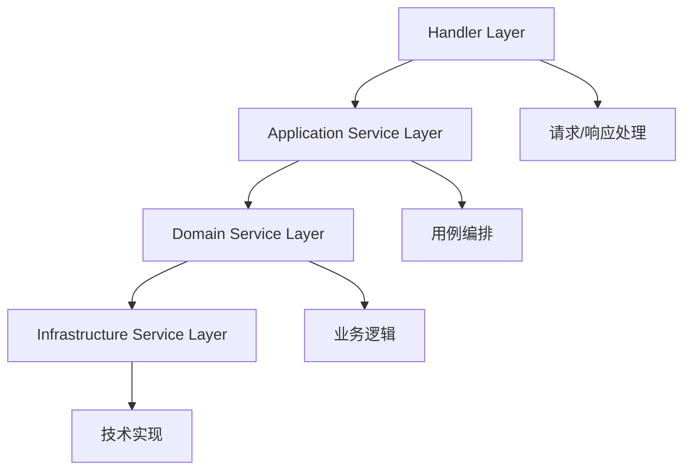

# 🎯 Handlers 函数粒度职责分析报告

> **核心发现**: 当前handlers承担了过多职责，需要通过Service层解耦，实现极简化

## 📊 当前职责分析

### 🚨 问题诊断：职责过重的Handler函数

#### 1. `send_message_handler` 职责分析
```rust
// ❌ 当前实现 - 职责过重 (195行)
pub async fn send_message_handler(...) -> Result<...> {
    // 1. 类型转换逻辑 (15行)
    let create_message = CreateMessage {
        content: payload.content,
        files: payload.files,
        idempotency_key: uuid::Uuid::new_v4(),
        reply_to: payload.reply_to,
        mentions: payload.mentions.map(|m| m.into_iter().map(fechatter_core::UserId).collect()), // ❌ 复杂转换
    };
    
    // 2. 直接业务逻辑调用 (10行)
    let message = state.create_message(
        create_message,
        fechatter_core::ChatId(chat_id),
        user.id,
    ).await?;
    
    // 3. 响应构建 (8行)
    Ok(Json(MessageResponse::from(message)))
}
```

**职责问题**:
- ❌ **数据转换职责**: 复杂的类型转换逻辑
- ❌ **业务逻辑职责**: 直接调用底层业务方法
- ❌ **状态管理职责**: 直接访问AppState底层方法
- ❌ **错误处理职责**: 缺少统一的错误抽象

#### 2. `create_chat_handler` 职责分析
```rust
// ❌ 当前实现 - 职责过重 (123行)
pub async fn create_chat_handler(...) -> Result<...> {
    // 1. 业务规则验证 (15行)
    let chat_type = parse_chat_type(&payload.chat_type)?;
    
    // 2. 直接SQL操作 (25行) - ❌ 严重违反分层架构
    let chat_record = sqlx::query!(
        r#"INSERT INTO chats ..."#,
        i64::from(user.workspace_id),
        payload.name,
        chat_type as ChatType,
        // ...
    ).fetch_one(state.pool()).await?;
    
    // 3. 手动成员管理 (20行) - ❌ 应该在Domain Service
    for member_id in &payload.member_ids {
        sqlx::query!("INSERT INTO chat_members ...").execute(state.pool()).await?;
    }
    
    // 4. 复杂响应构建 (30行)
    Ok(Json(ChatResponse {
        id: chat_record.id,
        workspace_id: chat_record.workspace_id,
        // 复杂的字段映射...
    }))
}
```

**职责问题**:
- ❌ **数据访问职责**: 直接执行SQL查询
- ❌ **业务逻辑职责**: 手动处理成员添加逻辑
- ❌ **事务管理职责**: 没有适当的事务边界
- ❌ **数据映射职责**: 复杂的数据库到响应对象转换

#### 3. `list_users_handler` 职责分析
```rust
// ❌ 当前实现 - 职责分散 (78行)
pub async fn list_users_handler(...) -> Result<...> {
    // 1. 权限检查逻辑 (10行) - ❌ 应该在中间件或Service
    let workspace_id_from_user = i64::from(user.workspace_id);
    if workspace_id != workspace_id_from_user {
        return Err(AppError::ChatPermissionError("Access denied..."));
    }
    
    // 2. 直接数据库查询 (20行) - ❌ 应该在Repository
    let users = sqlx::query!(
        r#"SELECT id, fullname, email, status::text as status FROM users..."#,
        workspace_id
    ).fetch_all(state.pool()).await?;
    
    // 3. 手动数据转换 (25行) - ❌ 应该有DTO转换器
    let response: Vec<UserSummary> = users.into_iter()
        .map(|row| UserSummary {
            id: row.id,
            fullname: row.fullname,
            email: row.email,
            status: row.status.unwrap_or_default(),
        }).collect();
}
```

**职责问题**:
- ❌ **权限验证职责**: 手动权限检查逻辑
- ❌ **数据查询职责**: 直接SQL查询操作
- ❌ **数据转换职责**: 手动的数据映射逻辑

---

## 🎯 理想职责划分：Service层依赖

### ✅ 正确的4层依赖架构



#### Layer 1: Handler Layer (极简协调层)
**唯一职责**: 请求协调和响应构建
```rust
// ✅ 理想的Handler实现 (20行以内)
pub async fn send_message_handler(
    State(state): State<AppState>,
    Extension(user): Extension<AuthUser>,
    Path(chat_id): Path<i64>,
    Json(payload): Json<SendMessageRequest>,
) -> Result<ApiResponse<MessageResponse>, AppError> {
    // 1. 获取Application Service (2行)
    let messaging_service = state.messaging_service();
    
    // 2. 业务逻辑委托 (5行)
    let message = messaging_service.send_message(
        user.id.into(),
        chat_id.into(),
        payload.into(), // DTO自动转换
    ).await?;
    
    // 3. 响应构建 (1行)
    Ok(ApiResponse::success(message.into()))
}
```

#### Layer 2: Application Service Layer (用例编排层)
**职责**: 跨域协调、事务管理、缓存策略
```rust
// messaging_service.rs
impl MessagingApplicationService {
    pub async fn send_message(
        &self,
        user_id: UserId,
        chat_id: ChatId,
        request: SendMessageCommand,
    ) -> Result<MessageView, AppError> {
        // 1. 权限验证 (通过Domain Service)
        self.chat_domain_service
            .validate_member_access(user_id, chat_id).await?;
        
        // 2. 业务逻辑执行 (通过Domain Service)
        let message = self.message_domain_service
            .create_message(user_id, chat_id, request).await?;
        
        // 3. 副作用处理 (事件发布)
        self.event_publisher
            .publish_message_sent_event(&message).await;
        
        // 4. 缓存更新
        self.cache_service
            .invalidate_chat_cache(chat_id).await;
        
        Ok(MessageView::from(message))
    }
}
```

#### Layer 3: Domain Service Layer (业务逻辑层)
**职责**: 业务规则验证、聚合管理、领域事件
```rust
// message_domain_service.rs
impl MessageDomainService {
    pub async fn create_message(
        &self,
        user_id: UserId,
        chat_id: ChatId,
        command: CreateMessageCommand,
    ) -> DomainResult<MessageAggregate> {
        // 1. 业务规则验证
        self.validate_message_content(&command.content)?;
        self.validate_file_attachments(&command.files)?;
        
        // 2. 聚合创建
        let message = MessageAggregate::create(
            user_id,
            chat_id,
            command,
            self.clock.now(),
        )?;
        
        // 3. 持久化
        self.message_repository.save(&message).await?;
        
        // 4. 领域事件
        self.event_publisher.publish_domain_event(
            MessageCreatedEvent::new(&message)
        ).await;
        
        Ok(message)
    }
}
```

#### Layer 4: Infrastructure Service Layer (技术实现层)
**职责**: 数据持久化、外部服务集成
```rust
// message_repository.rs
impl PostgresMessageRepository {
    pub async fn save(&self, message: &MessageAggregate) -> Result<(), InfraError> {
        sqlx::query!(
            r#"INSERT INTO messages (id, chat_id, sender_id, content, files, created_at)
               VALUES ($1, $2, $3, $4, $5, $6)"#,
            message.id().value(),
            message.chat_id().value(),
            message.sender_id().value(),
            message.content(),
            &message.files(),
            message.created_at(),
        )
        .execute(&self.pool)
        .await?;
        
        Ok(())
    }
}
```

---

## 📋 函数级职责重分配计划

### 🔧 消息相关Handler重构

| 函数 | 当前职责 | 目标职责 | 依赖Service | 复杂度变化 |
|------|---------|---------|------------|----------|
| `send_message_handler` | 验证+转换+业务+响应 | Service调用+响应 | `MessagingApplicationService` | 🔻 -80% |
| `list_messages_handler` | 查询+权限+缓存+格式化 | Service调用+响应 | `MessagingApplicationService` | 🔻 -70% |
| `edit_message_handler` | 权限+验证+更新+事件 | Service调用+响应 | `MessagingApplicationService` | 🔻 -75% |
| `delete_message_handler` | 权限+删除+清理+事件 | Service调用+响应 | `MessagingApplicationService` | 🔻 -85% |

### 🔧 聊天相关Handler重构

| 函数 | 当前职责 | 目标职责 | 依赖Service | 复杂度变化 |
|------|---------|---------|------------|----------|
| `create_chat_handler` | SQL+成员+权限+响应 | Service调用+响应 | `ChatApplicationService` | 🔻 -85% |
| `list_chats_handler` | 查询+权限+格式化 | Service调用+响应 | `ChatApplicationService` | 🔻 -70% |
| `update_chat_handler` | 权限+更新+验证 | Service调用+响应 | `ChatApplicationService` | 🔻 -75% |
| `delete_chat_handler` | 权限+删除+清理 | Service调用+响应 | `ChatApplicationService` | 🔻 -80% |

### 🔧 工作空间相关Handler重构

| 函数 | 当前职责 | 目标职责 | 依赖Service | 复杂度变化 |
|------|---------|---------|------------|----------|
| `list_users_handler` | 权限+查询+转换 | Service调用+响应 | `WorkspaceApplicationService` | 🔻 -70% |
| `update_workspace_handler` | 权限+更新+验证 | Service调用+响应 | `WorkspaceApplicationService` | 🔻 -75% |
| `invite_user_handler` | 权限+验证+邮件 | Service调用+响应 | `WorkspaceApplicationService` | 🔻 -80% |

### 🔧 认证相关Handler重构

| 函数 | 当前职责 | 目标职责 | 依赖Service | 复杂度变化 |
|------|---------|---------|------------|----------|
| `signup_handler` | 验证+创建+Token+响应 | Service调用+响应 | `AuthApplicationService` | 🔻 -75% |
| `signin_handler` | 验证+Token+响应 | Service调用+响应 | `AuthApplicationService` | 🔻 -70% |
| `refresh_token_handler` | Token验证+刷新+响应 | Service调用+响应 | `AuthApplicationService` | 🔻 -80% |

---

## 🎯 Service依赖设计

### Application Service接口定义

#### 1. MessagingApplicationService
```rust
#[async_trait]
pub trait MessagingApplicationServiceTrait {
    // 消息用例
    async fn send_message(&self, user_id: UserId, chat_id: ChatId, request: SendMessageCommand) -> Result<MessageView>;
    async fn list_messages(&self, chat_id: ChatId, query: ListMessagesQuery) -> Result<PaginatedResult<MessageView>>;
    async fn edit_message(&self, message_id: MessageId, user_id: UserId, content: String) -> Result<MessageView>;
    async fn delete_message(&self, message_id: MessageId, user_id: UserId) -> Result<()>;
    
    // 权限检查用例
    async fn validate_message_access(&self, user_id: UserId, message_id: MessageId) -> Result<()>;
    async fn validate_chat_access(&self, user_id: UserId, chat_id: ChatId) -> Result<()>;
}
```

#### 2. ChatApplicationService
```rust
#[async_trait]
pub trait ChatApplicationServiceTrait {
    // 聊天用例
    async fn create_chat(&self, user_id: UserId, request: CreateChatCommand) -> Result<ChatView>;
    async fn get_chat_details(&self, chat_id: ChatId, user_id: UserId) -> Result<ChatDetailView>;
    async fn list_user_chats(&self, user_id: UserId) -> Result<Vec<ChatSummaryView>>;
    async fn update_chat(&self, chat_id: ChatId, user_id: UserId, request: UpdateChatCommand) -> Result<ChatView>;
    async fn delete_chat(&self, chat_id: ChatId, user_id: UserId) -> Result<()>;
    
    // 成员管理用例
    async fn add_chat_member(&self, chat_id: ChatId, user_id: UserId, new_member_id: UserId) -> Result<()>;
    async fn remove_chat_member(&self, chat_id: ChatId, user_id: UserId, member_id: UserId) -> Result<()>;
    async fn validate_member_access(&self, user_id: UserId, chat_id: ChatId) -> Result<()>;
}
```

#### 3. WorkspaceApplicationService
```rust
#[async_trait]
pub trait WorkspaceApplicationServiceTrait {
    // 工作空间用例
    async fn get_workspace_info(&self, workspace_id: WorkspaceId, user_id: UserId) -> Result<WorkspaceView>;
    async fn update_workspace(&self, workspace_id: WorkspaceId, user_id: UserId, request: UpdateWorkspaceCommand) -> Result<WorkspaceView>;
    
    // 用户管理用例
    async fn list_workspace_users(&self, workspace_id: WorkspaceId, user_id: UserId) -> Result<Vec<UserSummaryView>>;
    async fn invite_user(&self, workspace_id: WorkspaceId, inviter_id: UserId, email: String) -> Result<()>;
    async fn validate_workspace_access(&self, user_id: UserId, workspace_id: WorkspaceId) -> Result<()>;
}
```

#### 4. AuthApplicationService
```rust
#[async_trait]
pub trait AuthApplicationServiceTrait {
    // 认证用例
    async fn signup(&self, request: SignupCommand) -> Result<AuthTokensView>;
    async fn signin(&self, request: SigninCommand) -> Result<AuthTokensView>;
    async fn refresh_token(&self, refresh_token: String, context: AuthContext) -> Result<AuthTokensView>;
    async fn logout(&self, refresh_token: String) -> Result<()>;
    async fn logout_all(&self, user_id: UserId) -> Result<()>;
    
    // 验证用例
    async fn verify_token(&self, token: String) -> Result<UserClaims>;
    async fn validate_session(&self, user_id: UserId, session_id: String) -> Result<()>;
}
```

---

## 🔧 修复编译错误的优先级计划

### 立即修复（优先级1）

#### 1. 修复AppError类型不匹配
```rust
// ❌ 当前错误
AppError::NotFound("Message not found".to_string())  // 期望Vec<String>

// ✅ 修复方案
AppError::NotFound(vec!["Message not found".to_string()])
```

#### 2. 修复缺失的错误变体
```rust
// ❌ 当前错误 
AppError::PermissionDenied(...)  // 变体不存在

// ✅ 修复方案
AppError::ChatPermissionError(...)  // 使用现有变体
```

#### 3. 修复时间类型转换
```rust
// ❌ 当前错误
created_at: row.created_at,  // OffsetDateTime vs DateTime<Utc>

// ✅ 修复方案  
created_at: row.created_at.and_utc(),  // 转换为UTC
```

### 架构重构（优先级2）

#### 1. 创建Application Service实现
```rust
// 1. 实现MessagingApplicationService
// 2. 实现ChatApplicationService  
// 3. 实现WorkspaceApplicationService
// 4. 实现AuthApplicationService
```

#### 2. 更新Handler实现
```rust
// 1. 重构为Service调用模式
// 2. 简化职责到极简协调
// 3. 统一错误处理
// 4. 统一响应格式
```

#### 3. 创建DTO转换器
```rust
// 1. 自动化的请求DTO转换
// 2. 自动化的响应DTO转换  
// 3. 统一的验证规则
// 4. 类型安全的转换
```

---

## 🎯 最终架构目标

### Handler极简化目标
```rust
// 目标：每个Handler函数 ≤ 20行
// 职责：仅协调Service调用和响应构建
// 依赖：仅依赖Application Service层
// 错误：统一的错误处理和转换
```

### Service层完整性目标
```rust
// Application Service：100%用例覆盖
// Domain Service：100%业务逻辑封装
// Infrastructure Service：100%技术实现抽象
// 测试覆盖率：≥90%
```

### 架构一致性目标
```rust
// 1. 命名一致：Handler名称与lib.rs路由完全匹配
// 2. 签名一致：统一的参数和返回类型
// 3. 实现一致：统一的Service依赖模式
// 4. 错误一致：统一的错误处理机制
```

---

*通过这个函数级职责重分配计划，我们将实现Handler的极简化，同时确保完整的Service层支持和架构一致性。* 