# Handlers Documentation Directory

## 📚 Handler Development Guide

作为全人类最厉害的Rust工程师设计的Handler层文档系统，提供从架构设计到具体实现的完整指导。

## 📂 Documentation Structure

### 🏗️ Architecture Guides

#### Services Architecture
- **[SERVICES_USAGE_GUIDE.md](./SERVICES_USAGE_GUIDE.md)** - 完整的Services调用使用指南
  - Application/Infrastructure层服务详解
  - Handler → Service调用模式
  - 错误处理和最佳实践
  - Handler模板和示例代码

- **[SERVICES_QUICK_REFERENCE.md](./SERVICES_QUICK_REFERENCE.md)** - Services快速API参考
  - 认证/聊天/用户/消息/通知服务速查
  - Handler模板和错误处理模式
  - 调试技巧和性能优化

- **[SERVICES_DIRECTORY_STRUCTURE.md](./SERVICES_DIRECTORY_STRUCTURE.md)** - Services目录结构总结
  - Application/Infrastructure层职责划分
  - 服务依赖关系图
  - 迁移状态和参考文档

#### DTOs Architecture
- **[DTOS_USAGE_GUIDE.md](./DTOS_USAGE_GUIDE.md)** - 完整的DTOs使用指南
  - Request/Response DTOs使用方法
  - 数据验证、转换和映射
  - 错误处理和批量处理
  - Handler集成模板

- **[DTOS_QUICK_REFERENCE.md](./DTOS_QUICK_REFERENCE.md)** - DTOs快速API参考
  - 认证/聊天/消息/用户DTOs速查
  - 验证和转换模式
  - 错误处理和调试技巧

- **[DTOS_ARCHITECTURE_SUMMARY.md](./DTOS_ARCHITECTURE_SUMMARY.md)** - DTOs架构总结
  - Clean Architecture合规性
  - 数据流模式和转换框架
  - 性能优化和错误处理策略

### 📋 Handler Responsibility Analysis
- **[HANDLER_RESPONSIBILITY_ANALYSIS.md](./HANDLER_RESPONSIBILITY_ANALYSIS.md)** - Handler职责分析
  - 当前Handler问题分析
  - Clean Architecture分层设计
  - 函数级职责划分

- **[HANDLER_REFACTORING_ROADMAP.md](./HANDLER_REFACTORING_ROADMAP.md)** - Handler重构路线图
  - 4阶段重构计划
  - 具体实现示例
  - 测试和验证策略

## 🎯 Quick Start Guide

### 1. 新Handler开发流程

```rust
// Step 1: 使用DTOs处理请求
use crate::dtos::models::requests::YourRequest;
use crate::dtos::models::responses::YourResponse;

pub async fn your_handler(
  State(state): State<AppState>,
  Extension(user): Extension<AuthUser>,
  Json(mut request): Json<YourRequest>,
) -> Result<Json<YourResponse>, AppError> {
  // Step 2: 验证和转换
  request.preprocess()?;
  request.validate()?;
  let domain_input = request.to_domain()?;
  
  // Step 3: 调用Service
  let service = state.your_service()?;
  let result = service.your_operation(domain_input).await?;
  
  // Step 4: 构建响应
  let response = YourResponse::from_domain(&result)?;
  Ok(Json(response))
}
```

### 2. 文档查阅优先级

1. 🚀 **开发新功能**: 先看 `DTOS_QUICK_REFERENCE.md` + `SERVICES_QUICK_REFERENCE.md`
2. 🔧 **调试问题**: 查看具体的Usage Guide了解错误处理
3. 🏗️ **架构理解**: 阅读Architecture Summary了解设计原理
4. 📋 **重构现有代码**: 参考Responsibility Analysis和Refactoring Roadmap

### 3. 常用模板速查

#### 标准CRUD Handler
```rust
pub async fn crud_handler(
  State(state): State<AppState>,
  Extension(user): Extension<AuthUser>,
  Json(request): Json<CreateRequest>,
) -> Result<Json<ApiResponse<ResourceResponse>>, AppError> {
  request.validate()?;
  let domain_input = request.to_domain()?;
  let resource = state.service()?.create(domain_input).await?;
  let response = ResourceResponse::from_domain(&resource)?;
  Ok(Json(ApiResponse::success(response, "Created".to_string())))
}
```

#### 分页查询Handler
```rust
pub async fn paginated_handler(
  State(state): State<AppState>,
  Query(pagination): Query<PaginationQuery>,
) -> Result<Json<PaginatedResponse<ItemResponse>>, AppError> {
  pagination.validate()?;
  let (items, total) = state.service()?.list_paginated(pagination).await?;
  let responses = ItemResponse::from_domain_collection(&items)?;
  Ok(Json(PaginatedResponse::new(responses, pagination.page, pagination.limit, total)))
}
```

## 🛡️ Best Practices Summary

### ✅ Handler层应该做的
- 📥 **接收并验证请求**: 使用Request DTOs和验证框架
- 🔄 **调用业务服务**: 通过Application Service执行业务逻辑
- 📤 **构建统一响应**: 使用Response DTOs和标准格式
- 🚨 **处理错误边界**: 转换和包装错误为HTTP响应

### ❌ Handler层不应该做的
- 💾 **直接数据库操作**: 使用Repository和Service抽象
- 🧠 **复杂业务逻辑**: 委托给Application/Domain Service
- 🔧 **基础设施关注**: 避免直接调用Infrastructure Service
- 🔀 **跨领域协调**: 在Application Service层处理

### 🎯 关键原则
1. **极简协调**: Handler应该≤20行，仅做协调
2. **依赖正确**: Handler → Application → Infrastructure
3. **错误清晰**: 提供详细的错误信息和上下文
4. **类型安全**: 使用强类型和编译时检查

## 🔗 Related Resources

### External References
- [Clean Architecture](https://blog.cleancoder.com/uncle-bob/2012/08/13/the-clean-architecture.html) - Robert Martin的Clean Architecture原理
- [Axum Framework](https://docs.rs/axum/) - Rust Web框架文档
- [Rust Error Handling](https://doc.rust-lang.org/book/ch09-00-error-handling.html) - Rust错误处理最佳实践

### Internal References
- `fechatter_core/` - 核心业务模型和contracts
- `src/services/` - Service层实现
- `src/dtos/` - DTOs实现
- `src/middlewares/` - 中间件实现

---

## 📈 Development Workflow

```mermaid
graph LR
    Start[开始开发] --> Docs[查阅文档]
    Docs --> DTOs[定义DTOs]
    DTOs --> Service[调用Service]
    Service --> Handler[实现Handler]
    Handler --> Test[编写测试]
    Test --> Review[代码审查]
    Review --> Deploy[部署]
```



遵循这个文档体系，你的Handler开发将更加高效和规范！🎉 