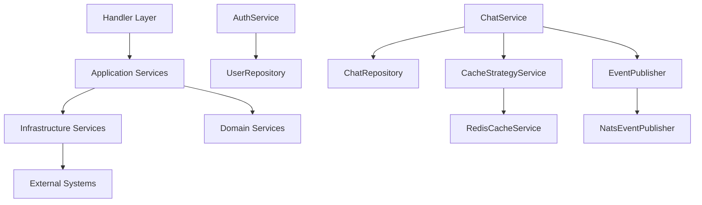

# Services Directory Structure

## 📁 Current Clean Architecture

```
src/services/
├── mod.rs                     # 模块导出管理
├── service_provider.rs        # 🏭 DI容器 - 统一服务提供者
│
├── application/               # 📋 Application Layer - 用例编排层
│   ├── mod.rs                # 应用服务导出
│   ├── auth_app_service.rs   # 🔐 认证应用服务
│   ├── chat_app_service.rs   # 💬 聊天应用服务  
│   ├── user_app_service.rs   # 👤 用户应用服务
│   ├── notification_app_service.rs # 🔔 通知应用服务
│   ├── message_stream.rs     # 📧 消息流处理服务
│   ├── indexer_sync_service.rs # 🔍 搜索索引同步服务
│   ├── cache_strategy_service.rs # 💾 缓存策略服务
│   ├── application_event_publisher.rs # 📡 应用事件发布器
│   └── optimized_service_architecture.rs # 🏗️ 优化架构参考
│
└── infrastructure/           # 🛠️ Infrastructure Layer - 技术实现层
    ├── mod.rs               # 基础设施导出
    ├── third_party_manager.rs # 🔌 第三方服务管理
    ├── event_publisher.rs   # 📡 NATS事件发布器
    │
    ├── cache/               # 💾 缓存服务
    │   ├── mod.rs
    │   └── redis.rs        # Redis缓存实现
    │
    ├── storage/             # 💽 存储服务
    │   ├── mod.rs
    │   ├── local.rs        # 本地文件存储
    │   ├── s3.rs           # AWS S3存储
    │   └── minio.rs        # MinIO存储
    │
    ├── search/              # 🔍 搜索服务
    │   ├── mod.rs
    │   ├── search_service.rs # 搜索服务抽象
    │   └── meilisearch.rs  # MeiliSearch实现
    │
    ├── vector_db/           # 🧠 向量数据库
    │   ├── mod.rs
    │   ├── pgvector.rs     # PgVector实现
    │   └── pinecone.rs     # Pinecone实现
    │
    ├── event/               # 📡 事件基础设施
    │   ├── mod.rs
    │   ├── event_publisher.rs # NATS事件发布
    │   └── transport.rs    # 事件传输层
    │
    ├── messaging/           # 📨 消息基础设施
    │   ├── mod.rs
    │   └── messaging_infrastructure.rs
    │
    └── notification/        # 🔔 通知基础设施
        ├── mod.rs
        └── channels.rs     # 通知渠道实现
```

## 🎯 Layer Responsibilities

### Application Layer (`application/`)
**职责**: Use Case编排、跨领域协调、事务管理

| Service | 功能 | 核心职责 |
|---------|------|----------|
| **AuthService** | 认证授权 | 用户注册/登录/登出/Token管理 |
| **ChatService** | 聊天管理 | 聊天创建/成员管理/权限控制 |
| **UserAppService** | 用户管理 | 用户信息/工作空间/配置文件 |
| **NotificationService** | 通知推送 | 实时通知/设置管理/推送策略 |
| **MessageStream** | 消息流 | 实时消息处理/WebSocket管理 |
| **IndexerSyncService** | 搜索同步 | 消息索引/搜索数据同步 |
| **CacheStrategyService** | 缓存策略 | 统一缓存管理/失效策略 |
| **ApplicationEventPublisher** | 事件发布 | 域事件发布/事件处理协调 |

### Infrastructure Layer (`infrastructure/`)
**职责**: 技术实现、外部集成、数据持久化

| Category | Service | 实现 |
|----------|---------|------|
| **缓存** | RedisCacheService | Redis缓存操作 |
| **存储** | LocalStorage<br>S3Storage<br>MinIOStorage | 文件存储抽象实现 |
| **搜索** | MeilisearchClient<br>SearchService | 全文搜索功能 |
| **向量DB** | PgVectorDatabase<br>PineconeClient | AI向量存储/相似度搜索 |
| **事件** | NatsEventPublisher<br>EventTransport | 消息队列/事件驱动 |
| **通知** | NotificationChannels | 邮件/短信/推送通知 |

## 🔗 Service Access Patterns

### 1. Handler → Application Service (推荐)
```rust
// ✅ 标准模式
let chat_service = state.chat_application_service()?;
let result = chat_service.create_chat(input).await?;
```

### 2. Application Service → Infrastructure Service
```rust
// ✅ 分层调用
impl ChatService {
  async fn create_chat(&self, input: CreateChatInput) -> Result<ChatDetailView, AppError> {
    // 使用缓存服务
    let cached = self.cache_strategy.get(&cache_key).await?;
    
    // 使用仓储服务  
    let chat = self.repository.create(chat_data).await?;
    
    // 发布事件
    self.event_publisher.publish(ChatCreatedEvent { chat_id }).await?;
    
    Ok(chat_detail)
  }
}
```

### 3. Service Provider Integration
```rust
// 🏭 服务提供者模式
impl UnifiedServiceProvider {
  pub fn chat_service(&self) -> Arc<dyn ChatServiceTrait> {
    // 注入依赖
    Arc::new(ChatService::new(
      self.chat_repository(),
      self.cache_strategy_service(),
      self.event_publisher(),
    ))
  }
}
```

## 📊 Service Dependencies



## 🚀 Migration Status

### ✅ Completed
- [x] Infrastructure层清理 - 删除冗余文件
- [x] Application层重构 - 用例编排分离
- [x] Service Provider优化 - DI容器模式
- [x] 文档系统完善 - 使用指南创建

### 🔄 In Progress  
- [ ] lib.rs编译错误修复 - imports优化
- [ ] AppState服务访问方法 - 完善API
- [ ] Handler极简化改造 - 移除SQL操作

### 📋 TODO
- [ ] 单元测试补充 - Service层测试
- [ ] 集成测试完善 - 端到端测试
- [ ] 性能优化分析 - 服务调用链优化
- [ ] 监控指标添加 - 服务健康检查

## 📚 Reference Documents

1. **[SERVICES_USAGE_GUIDE.md](./SERVICES_USAGE_GUIDE.md)** - 完整使用指南
2. **[SERVICES_QUICK_REFERENCE.md](./SERVICES_QUICK_REFERENCE.md)** - 快速API参考
3. **[HANDLER_RESPONSIBILITY_ANALYSIS.md](./HANDLER_RESPONSIBILITY_ANALYSIS.md)** - Handler职责分析

---

**🎯 核心原则**: Handler极简、Service分层、依赖清晰、职责单一 