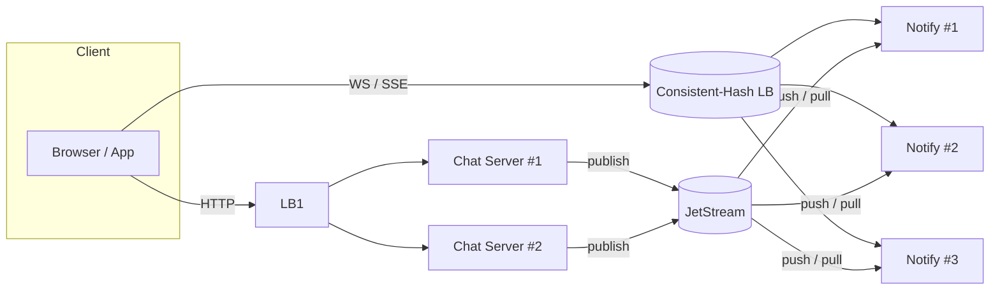

# Notify Server Architecture

## Overview

The Notify Server is responsible for real-time message delivery and notifications in the Fechatter application. It serves as the communication bridge between chat servers and connected clients. This document outlines the architecture, scaling mechanisms, and implementation details of the notification system.

## Architecture Components

The notification system consists of several key components:

## Component Descriptions

### 1. Client Layer

- **Browser/Mobile Apps**: End-user interfaces for sending and receiving messages
- **WebSocket Connections**: Long-lived connections for receiving real-time updates

### 2. Chat Server Layer

- **API Endpoints**: Handle HTTP requests for chat operations
- **Message Publishing**: Publish messages to the message broker when new messages are created

### 3. Notify Server Layer

- **WebSocket Handlers**: Manage client WebSocket connections
- **Client Connection Manager**: Track active client connections and their subscriptions
- **Message Broker Integration**: Subscribe to relevant message topics and forward to clients

### 4. Message Broker (Future: NATS JetStream)

- **Message Distribution**: Route messages from publishers to subscribers
- **Persistence**: Store messages for reliability and recovery
- **Stream Processing**: Enable filtering, transformation, and aggregation of message streams

## Horizontal Scaling Mechanisms

The notification system is designed for horizontal scalability, allowing it to handle increasing load by adding more instances rather than scaling vertically.

### Load Balancer Configuration

Two types of load balancers are employed for different traffic patterns:

1. **Stateless Load Balancer (HTTP/REST)**
   - Routes HTTP API requests to any available chat server
   - Simple round-robin or least-connections strategy
   - No session affinity required for REST endpoints

2. **Consistent-Hash Load Balancer (WebSocket/SSE)**
   - Routes WebSocket connections to specific notify servers
   - Uses consistent hashing based on client ID or session ID
   - Ensures that reconnections from the same client typically reach the same server
   - Minimizes connection redistribution when scaling the cluster

### Message Broker Architecture

The message broker serves as the communication backbone:

1. **Publish-Subscribe Pattern**
   - Chat servers publish messages to topics (e.g., chat rooms, user IDs)
   - Notify servers subscribe to topics relevant to their connected clients
   - Decouples message producers from consumers

2. **Message Distribution**
   - Messages published by chat servers are distributed to all interested notify servers
   - Each notify server forwards messages only to relevant connected clients
   - Enables efficient multicasting to thousands of clients

### Connection Management

Scaling WebSocket connections across multiple notify servers:

1. **Connection State Management**
   - Each notify server manages its own client connections
   - Connection state is tracked locally for performance
   - Minimal cross-server state sharing for efficiency

2. **Connection Distribution**
   - New connections are distributed across notify servers by the load balancer
   - Consistent hashing minimizes connection redistribution during scaling events

## Future Roadmap: NATS JetStream Implementation

As part of our future roadmap, we plan to leverage NATS JetStream as our message broker:

### Advantages of NATS JetStream

1. **High Performance**: Capable of millions of messages per second
2. **Persistence**: Optional message storage for reliability
3. **Horizontal Scalability**: Distributed architecture for scaling
4. **Stream Processing**: Advanced message filtering and transformation
5. **Exactly-Once Delivery**: Optional acknowledgment and persistence mechanisms
6. **Multi-Tenancy**: Support for isolated message streams

### Implementation Roadmap

1. **Message Streams**
   - Create a stream for each workspace
   - Use subject hierarchies (e.g., `workspace.123.chat.456.messages`)
   - Enable message replay for client catch-up

2. **Consumer Configuration**
   - Configure durable consumers for notify servers
   - Use queue groups to load-balance message processing across instances
   - Implement acknowledgment for reliable delivery

3. **Key-Value Store**
   - Use NATS KV for shared state when needed
   - Store presence information, user settings, and other lightweight data

4. **Integration Points**
   - Chat server publishes messages using the NATS client
   - Notify server subscribes using consumer groups
   - Include metadata for routing and filtering

## Connection Flow

The connection flow for real-time notifications follows this pattern:

1. **Client Connection**
   - Client connects via WebSocket to the consistent-hash load balancer
   - Load balancer routes to a specific notify server based on client ID
   - Client authenticates and subscribes to relevant channels (chats, user notifications)

2. **Message Publication**
   - User sends message via HTTP to any chat server
   - Chat server processes, stores in database, then publishes to the message broker
   - Message includes metadata: sender, chat ID, timestamp, etc.

3. **Message Distribution**
   - Message broker distributes message to all notify servers subscribed to that chat
   - Each notify server filters for relevant connected clients
   - Message is forwarded to appropriate WebSocket connections

4. **Scaling Events**
   - When adding a new notify server, consistent hashing redistributes some connections
   - Affected clients reconnect to their newly assigned server
   - New server subscribes to relevant topics based on connected clients

## High Availability and Fault Tolerance

The notification system is designed for resilience:

1. **Server Redundancy**
   - Multiple notify servers operate in parallel
   - Failure of one server affects only its connected clients

2. **Message Persistence**
   - In the future, NATS JetStream will persist messages for configurable duration
   - Clients can request message replay after reconnection

3. **Automatic Recovery**
   - Clients automatically reconnect when connections are lost
   - Load balancer redirects to available servers
   - Message sequence tracking ensures no message loss

## Monitoring and Operational Concerns

Operational aspects of the notification system:

1. **Performance Metrics**
   - Connection count per server
   - Message throughput
   - Delivery latency
   - Subscription count

2. **Scaling Triggers**
   - Connection count thresholds
   - CPU/memory utilization
   - Message backlog size

3. **Alerting**
   - Connection spike/drop alerts
   - Delivery latency thresholds
   - Broker health metrics

## Future Enhancements

Planned improvements to the notification system:

1. **Message Compression**
   - Implement WebSocket message compression
   - Optimize payload size for mobile clients

2. **End-to-End Encryption**
   - Add support for client-side encryption
   - Implement key exchange mechanisms

3. **Advanced Presence**
   - Real-time typing indicators
   - Read receipts
   - Online status tracking

4. **Push Notifications**
   - Integration with mobile push notification services
   - Intelligent delivery selection (WebSocket vs. push)

## Conclusion

The Notify Server architecture provides a scalable, resilient foundation for real-time communication in Fechatter. By leveraging consistent-hash load balancing now and implementing NATS JetStream in the future, the system can efficiently scale to support millions of concurrent users while maintaining low latency and high availability. 