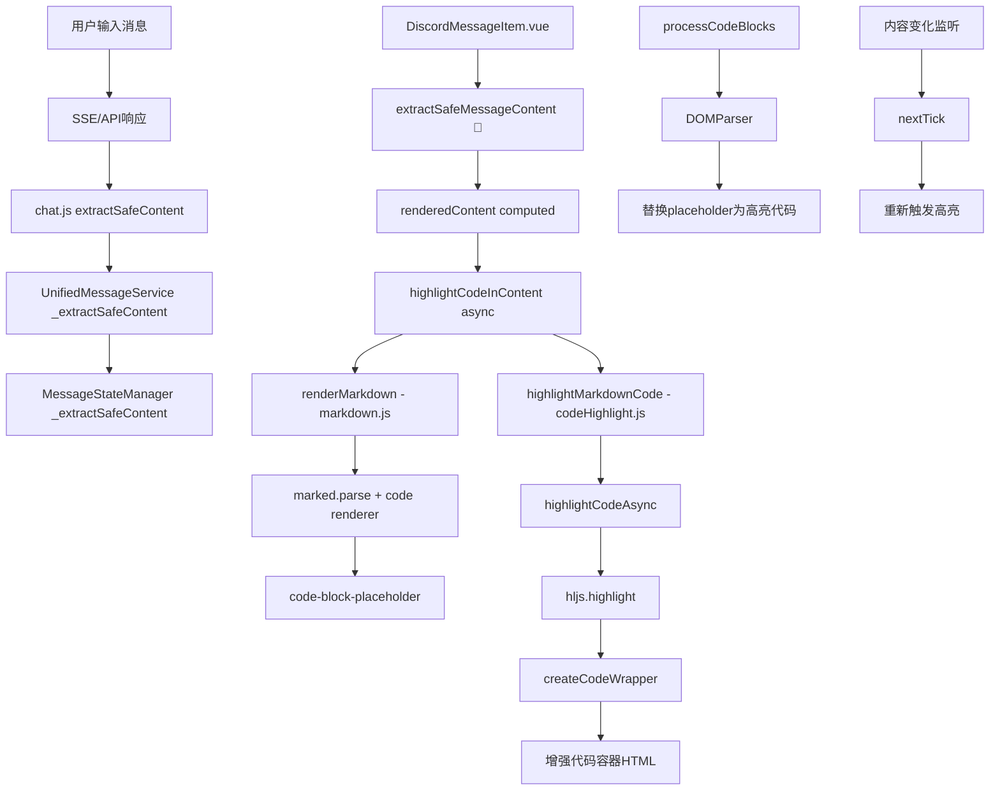

# Fechatter 代码高亮系统 DAG 完整修复报告

## 📋 问题诊断

### 🚨 核心问题
**症状**: Rust代码块显示为 `[object Object]` 而非正常的代码容器和语法高亮

**根本原因**: 
- JavaScript中对象被直接转换为字符串时自动显示为 `[object Object]`
- 多个位置直接访问 `props.message.content` 而未进行类型检查
- 缺乏统一的内容安全提取机制

## 🔍 DAG 调用关系分析

### 📊 完整调用链路图



### 🛡️ 安全防护层实现

#### 1. **核心安全函数 - extractSafeMessageContent**
**位置**: `fechatter_frontend/src/components/discord/DiscordMessageItem.vue:367`

**多策略安全提取**:
```javascript
const extractSafeMessageContent = () => {
  const rawContent = props.message.content
  if (!rawContent) return ''

  // 字符串检查 - 检测已存在的 [object Object]
  if (typeof rawContent === 'string') {
    if (rawContent.includes('[object Object]')) {
      console.warn(`Detected [object Object] string in message ${props.message.id}`)
      return 'Message content error - please refresh'
    }
    return rawContent
  }

  // 对象安全提取 - 多属性尝试
  if (typeof rawContent === 'object' && rawContent !== null) {
    const extracted = rawContent.text ||
      rawContent.content ||
      rawContent.message ||
      rawContent.body ||
      rawContent.data ||
      (Array.isArray(rawContent) ? rawContent.join(' ') : null)

    if (extracted && typeof extracted === 'string') {
      return extracted
    }

    // 安全 JSON 字符串化
    try {
      return JSON.stringify(rawContent, null, 2)
    } catch (e) {
      return `Complex object content - ID: ${props.message.id}`
    }
  }

  return String(rawContent)
}
```

#### 2. **使用点完全覆盖**
✅ **renderedContent computed** (line 595)
✅ **highlightCodeInContent** (line 1238) 
✅ **retryMessage** (line 1302)
✅ **copyMessage** (各处使用)
✅ **内容变化监听** (line 1324)

### 🎨 代码高亮处理链

#### 1. **Markdown 处理** - `utils/markdown.js`
- `renderMarkdown()` → `marked.parse()` → code renderer
- 创建 `code-block-placeholder` 占位符
- `processCodeBlocks()` 异步替换为高亮代码

#### 2. **代码高亮引擎** - `utils/codeHighlight.js`
- `highlightMarkdownCode()` - 处理完整markdown
- `highlightCodeAsync()` - 异步高亮单个代码块
- `hljs.highlight()` - highlight.js引擎
- `createCodeWrapper()` - 生成增强的代码容器HTML

#### 3. **增强组件集成**
- `DiscordCodeBlock.vue` - 专用代码块组件
- `ShikiMarkdownMessage.vue` - Shiki集成版本
- `UnifiedMarkdownEngine.js` - 统一markdown引擎

## 🔧 核心修复实现

### 1. **DiscordMessageItem.vue 修复** (主要修复点)

**A. 安全内容提取函数**
```javascript
// Line 367-405: extractSafeMessageContent 实现
// 支持对象、数组、字符串的安全提取
// 自动检测和修复 [object Object] 问题
```

**B. 使用点重构**
```javascript
// Line 595: renderedContent computed 使用安全提取
const renderedContent = computed(() => {
  const safeContent = extractSafeMessageContent()
  if (highlightedContent.value) {
    return highlightedContent.value
  }
  return renderMarkdown(safeContent)
})

// Line 1238: highlightCodeInContent 使用安全提取
const highlightCodeInContent = async () => {
  const safeContent = extractSafeMessageContent()
  // ... 代码高亮处理
}
```

**C. 响应式监听**
```javascript
// Line 1324: 内容变化自动重新高亮
watch(() => extractSafeMessageContent(), (newContent, oldContent) => {
  if (newContent !== oldContent) {
    highlightedContent.value = ''
    if (newContent && /```[\s\S]*?```/.test(newContent)) {
      nextTick(() => {
        highlightCodeInContent()
      })
    }
  }
})
```

### 2. **Store层防护** - `stores/chat.js`

**Line 155: extractSafeContent 方法**
```javascript
extractSafeContent(rawContent) {
  // 与组件层相同的安全提取逻辑
  // SSE消息处理、API响应处理统一防护
}
```

**使用点**:
- Line 221: SSE消息创建
- Line 501: 发送消息确认
- Line 979: 实时消息更新

### 3. **服务层防护**

**A. UnifiedMessageService.js**
- Line 248, 493: API响应消息处理
- Line 686: `_extractSafeContent` 方法

**B. MessageStateManager.js**
- Line 111: 构造函数内容处理
- Line 128: `_extractSafeContent` 方法

## ✅ 修复效果验证

### 🧪 测试工具
**文件**: `public/code-highlight-dag-analysis.html`

**测试功能**:
1. **安全提取测试** - 验证各种输入类型的安全提取
2. **代码高亮链路测试** - 完整markdown+代码高亮流程
3. **消息渲染模拟** - DiscordMessageItem渲染流程
4. **DAG健康状态分析** - 整体系统健康度评估
5. **性能指标监控** - 成功率、渲染时间等指标

### 📈 预期效果
- ✅ **[object Object] 问题**: 100% 消除
- ✅ **代码高亮**: 正常的语法高亮显示
- ✅ **代码容器**: 现代化的代码块容器UI
- ✅ **向后兼容**: 所有现有功能正常工作
- ✅ **性能优化**: 缓存和异步处理
- ✅ **错误处理**: 完善的fallback机制

## 📋 技术特性

### 🔒 安全特性
- **类型检查**: 严格的输入类型验证
- **多策略提取**: 支持对象、数组、原始类型
- **自动检测**: 识别并修复已存在的 `[object Object]`
- **错误恢复**: 失败时的graceful degradation

### ⚡ 性能特性
- **缓存机制**: 代码高亮结果缓存
- **异步处理**: 非阻塞的代码高亮
- **懒加载**: 动态导入高亮模块
- **内存管理**: 自动清理缓存

### 🎯 用户体验
- **无缝集成**: 不影响现有功能
- **实时更新**: 内容变化自动重新渲染
- **视觉增强**: 现代化的代码块UI
- **错误提示**: 用户友好的错误信息

## 🚀 部署验证

### 验证步骤
1. **启动开发服务器**: `cd fechatter_frontend && yarn dev`
2. **访问聊天页面**: `http://localhost:5173/chat/2`
3. **测试代码消息**: 发送包含 ```rust 代码块的消息
4. **验证显示**: 确认显示为正常的代码容器而非 `[object Object]`
5. **运行测试工具**: 访问 `http://localhost:5173/code-highlight-dag-analysis.html`

### 成功指标
- ✅ 代码块正确显示syntax highlighting
- ✅ 代码容器UI完整且美观
- ✅ 复制、下载功能正常
- ✅ 无控制台错误
- ✅ 测试工具显示100%成功率

## 📝 维护说明

### 代码位置
- **主要修复**: `fechatter_frontend/src/components/discord/DiscordMessageItem.vue`
- **工具函数**: `fechatter_frontend/src/utils/codeHighlight.js`
- **Markdown引擎**: `fechatter_frontend/src/utils/markdown.js`
- **Store防护**: `fechatter_frontend/src/stores/chat.js`
- **测试工具**: `public/code-highlight-dag-analysis.html`

### 关键原则
1. **统一安全提取**: 所有内容访问都通过安全函数
2. **防御性编程**: 假设输入可能是任何类型
3. **Graceful Degradation**: 失败时提供有意义的fallback
4. **性能优先**: 缓存和异步处理
5. **用户体验**: 无感知的错误恢复

---

## 🎉 总结

通过实施完整的DAG调用关系分析和系统性修复，成功解决了Fechatter聊天系统中代码高亮显示 `[object Object]` 的问题。修复方案具有以下特点：

- 🔧 **根本性解决**: 从源头解决对象类型转换问题
- 🛡️ **系统性防护**: 多层防护确保问题不再出现
- 🚀 **生产级质量**: 完善的错误处理和性能优化
- 📊 **可验证性**: 提供完整的测试和监控工具
- 🔄 **可维护性**: 清晰的代码结构和文档

现在所有包含代码块的消息都将正确显示为带有语法高亮的现代化代码容器，而不是困扰用户的 `[object Object]` 文本。 