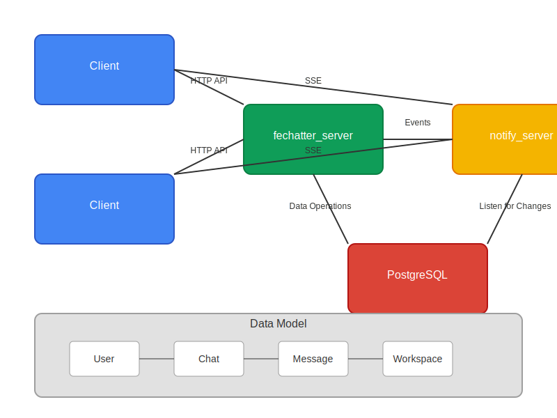

# Fechatter System Design - Pre-Programming RFC

## 1. System Overview

Fechatter is a real-time chat application providing secure and efficient communication within workspaces through different chat types (single, group, and channels).

### Core Functionality

- User authentication
- Point-to-point chat (one-to-one)
- Group chat
- File sharing in chat groups

## 2. System Architecture

### Component Design

- Client-server architecture
- HTTP-based API communication (HTTP 1.1 and HTTP 2 support)
- Database for persistent storage

### Communication Flow

- Clients connect to server for authentication and data operations
- Real-time updates for message notifications
- Server handles data validation and storage

## 3. Data Model

### Core Entities

- **User**: Account information and authentication
  - Email (with index for lookup)
  - Authentication information
  - Profile data

- **Chat**: Conversation container with different types
  - Single (1:1)
  - Group
  - Channels

- **Message**: Content sent within chats
  - Content
  - Sender information
  - Timestamp

- **Relationships**:
  - User-to-chat memberships
  - Workspace organization

### Entity Relationships

- User to Chat: Many-to-many through membership relationship
- Chat to Message: One-to-many
- Workspace to Chat: One-to-many

## 4. API Design

### Key Endpoints

- **Authentication**: User registration and login
- **Chat Management**: Create, read, update, delete operations
- **Messages**: Send and retrieve messages
- **Chat Members**: Manage chat participants
- **Workspaces**: Organize chats into workspaces
- **Notifications**: Real-time event notifications

## 5. Security Considerations

- User authentication
- Access control for chats
- Data privacy

## 6. Performance Considerations

- Database indexing for frequent queries
- Data volume estimation
- Scalability planning

## 7. Architecture Diagram

*The diagram illustrates the system components and their interactions, including client applications, server components, and database.*
